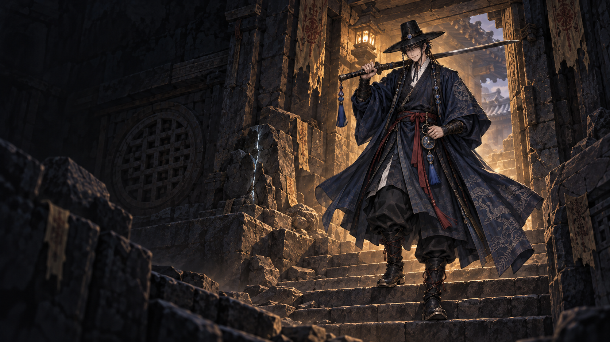
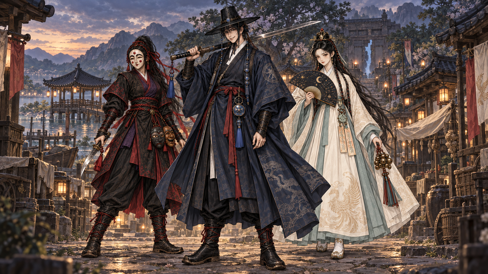
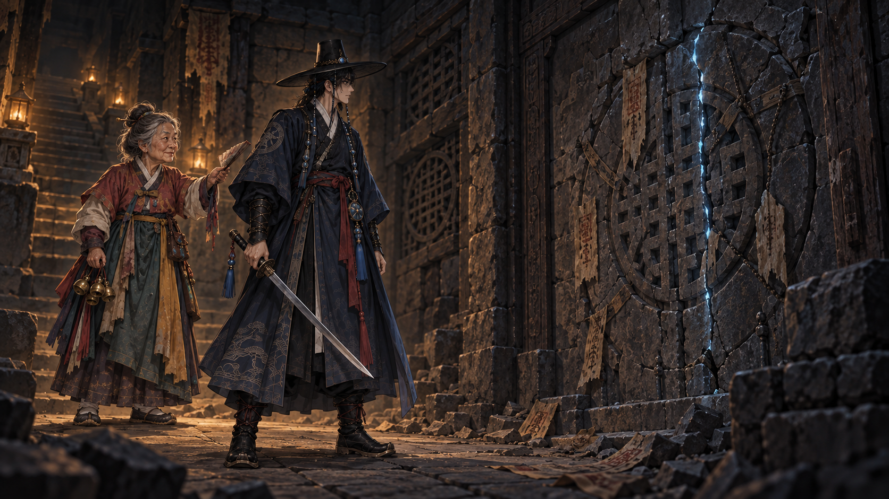

# 선택 외형 기반 아트 순차 제작 — 1차

2026-09-17 · D-068: 도호 D03 / 귀새 G02 / 청연 C01 / 구미호 F01→F03

새 원화 **21장**과 현행 도호 모델 비교 캡처 **2장**, 총 **23장**. 신규 후보는 `workbench` 제작 자료이며 기존 공식 레퍼런스나 게임 GLB를 교체하지 않는다. 원본 카탈로그의 선택은 그대로 유지한다.

## 빠르게 보기

### 21 — 도호 단독 키아트

### 22 — 3인방 세계관 포스터

### 23 — 기존 컷4: 봉인 벽

## 전체 목록

| 번호 | 결과 | 단계 |
|---|---|---|
| 01 | [도호 D03 단독 마스터](01_doho_D03_master.png) | 1 |
| 02 | [귀새 G02 단독 마스터](02_gwisae_G02_master.png) | 1 |
| 03 | [청연 C01 단독 마스터](03_cheongyeon_C01_master.png) | 1 |
| 04 | [구미호 F01 변신 전 마스터](04_gumiho_F01_master.png) | 1 |
| 05 | [구미호 F03 변신 후 마스터](05_gumiho_F03_master.png) | 1 |
| 06 | [도호 정면·측면·후면](06_doho_D03_turnaround.png) | 2 |
| 07 | [도호 흑립·검·장신구·부츠](07_doho_D03_details.png) | 2 |
| 08 | [현행 도호 GLB 정면·아이소·후면](08_current_model_audit.png) | 3 |
| 09 | [현행 도호 GLB 게임 카메라 크기 참고](09_current_model_native_scale.png) | 3 |
| 10 | [못골 낮 환경 키프레임](10_motgol_day_keyframe.png) | 4 |
| 11 | [봉인 석실 환경 키프레임](11_sealed_stone_keyframe.png) | 4 |
| 12 | [석실 바닥·벽·상하 계단 원화](12_stonekit_concepts.png) | 5 |
| 13 | [산적·박쥐·부적술사 원화](13_enemy_trio_concepts.png) | 5 |
| 14 | [흑랑 원화(크기 표시 수정)](14_heukrang_concept.png) | 5 |
| 15 | [상인·무당 할매·촌장 원화](15_npc_trio_concepts.png) | 5 |
| 16 | [귀새 정면·측면·후면](16_gwisae_G02_turnaround.png) | 6 |
| 17 | [청연 정면·측면·후면](17_cheongyeon_C01_turnaround.png) | 6 |
| 18 | [구미호 F01→F03 외형 연결](18_gumiho_F01_F03_continuity.png) | 6 |
| 19 | [구미호 후면 아홉 꼬리 구조 연구](19_gumiho_F03_rear_study.png) | 6 |
| 20 | [못골 우물·사당·서낭단·좌판](20_motgol_props.png) | 5 |
| 21 | [도호 단독 키아트](21_doho_keyart.png) | 7 |
| 22 | [3인방 세계관 포스터](22_trio_world_poster.png) | 7 |
| 23 | [기존 컷4 — 봉인 벽](23_cut4_seal_wall.png) | 7 |

단계: 1 단독 마스터 → 2 도호 제작 시트 → 3 기존 모델 비교 → 4 환경 키프레임 → 5 슬라이스 제작 원화 → 6 다른 캐릭터 상세 → 7 키아트·컷씬 파일럿.

## 제작 상태와 다음 작업

- **그림 후보 완료**: 목록 23장. 새 모델·애니메이션·실제 맵 제작 완료를 뜻하지 않는다.
- **기존 게임 상태 유지**: 도호 v2 유지 및 석실 킷 4종 반입은 다른 게임 제작 이력이다. 이번에 생성한 그림을 자동 반입하지 않았다.
- **도호 비교**: 큰 색·실루엣은 이미 가까움. D03에 더 맞출 경우 남색 농도·겹도포 형태·부츠 앞코부터 검토. PD의 v2 유지 결정을 바꾸는 작업 지시가 아니다.
- **턴어라운드**: 측면 팔 각도와 정면/후면 A-pose가 완전히 일치하지 않는다. 후면 문양·검집·매듭은 가려진 부분을 해석한 제작 제안이다. 실제 모델 입력 전에 포즈·좌우·크기를 맞춘 개별 뷰가 필요하다.
- **구미호**: 19번은 1~9 표시로 꼬리를 나눈 후면 구조 제안. 05·18번은 외형/동일 인물 비교용이며 3D 연결·리깅 검수는 남았다. F01→F03은 전투 페이즈 수를 확정하지 않는다.
- **석실/소품**: 시트의 치수·접합·계단 상승/하강 방향은 제작 검수 전이다. 기존 반입 타일의 치수와 코드 계약이 우선한다. 흑랑 14번은 크기 비교용 그림이 아니다.
- **홍보물**: 21번은 도호 중심 EA 홍보 후보. 22번은 세계관 캐스트 포스터로, EA에서 3인 플레이가 된다는 뜻이 아니다. 23번은 기존 컷4 파일럿 한 장이며 컷씬 8장 전체 완성본이 아니다.
- **실제 제작 순서**: 기존 도호 v2·타일 킷 유지 → 적 3종 → 흑랑 → NPC 3인. 귀새·청연의 3D/리깅은 EA 후순위. 아트 반입은 채택 파일 지목 후 기존 절차로 진행한다.

[전체 프롬프트](PROMPTS.md) · [원본·참조·SHA256·해상도](manifest.json) · [모델 비교 캡처 원문 로그](audit/capture.log)

## 왜 이 순서인가

선택한 얼굴과 복식을 먼저 분리하면 이후 배경·연출에서도 동일 인물을 참조할 수 있다. 도호 제작 시트와 현행 모델 비교를 먼저 두어 기존 GLB의 활용 가능성을 확인한 뒤 환경·적·소품으로 확장했다. 포스터부터 반복하는 방식은 복식과 배경이 동시에 흔들릴 수 있어 이번에는 마지막에 두었다.

## 보존

흑랑 최초 시안은 잘못된 크기 비교 실루엣을 제거한 14번으로 대체했다. 원본은 [archive/14_heukrang_scale_draft.png](archive/14_heukrang_scale_draft.png)에 남겼으며 23장 목록에는 중복 계산하지 않았다. 생성 도구의 정확한 내부 모델 ID는 노출되지 않아 GPT Image 2.5 사용을 확정하지 않는다.
