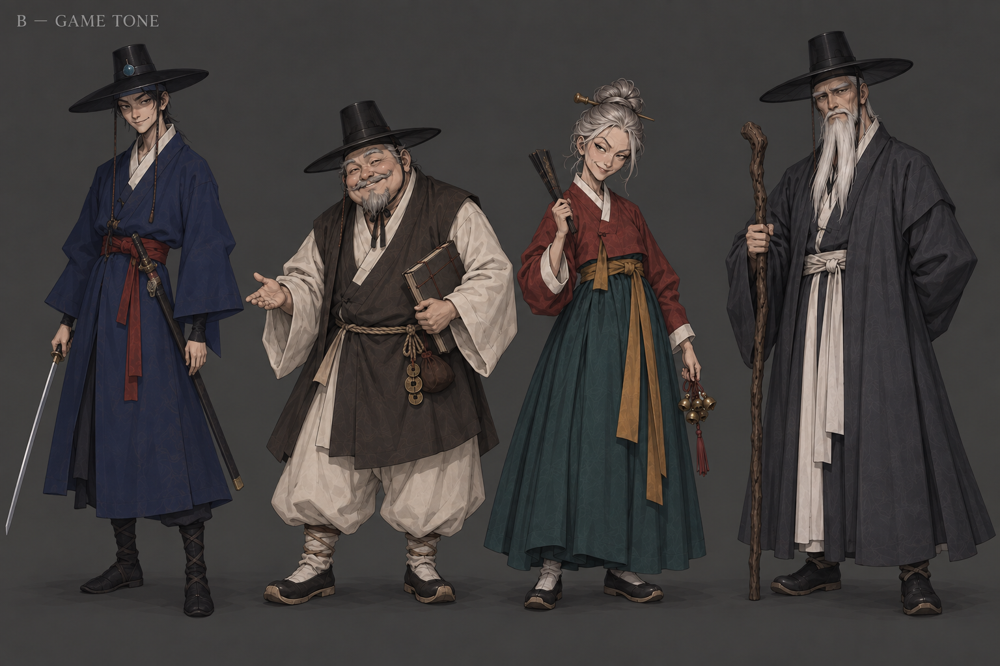
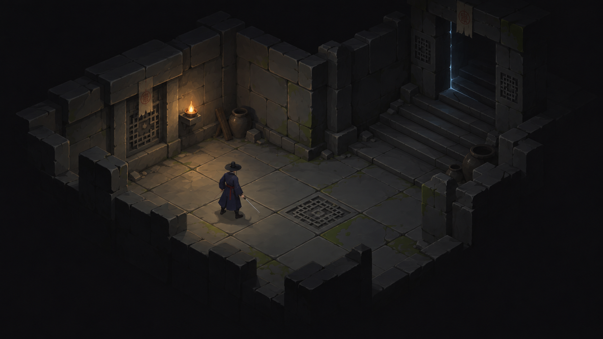

# 현재 3D·인게임 기준 아트 톤 정합 — 2026-09-17

PD: “다크판타지인데 너무 밝은것 같음. 지금 제작되는 3d에셋이나 인게임이랑 결을 같이 가야됨”

**D-070: 시각 바탕은 현재 3D·인게임과 맞춘 조선 다크 판타지.** 도호와 B1·B2·B3의 능청·개성은 유지한다. 얼굴과 역할은 B를 참고하고 색·명암·재질·장식 밀도는 실제 게임 자산을 우선한다.

| 종류 | 파일 | 의미 |
|---|---|---|
| 생성 시안 GT1 | [B 인물 4인 톤 시트](GT1_B_cast_game_tone.png) | 고유색·재질·장식 밀도 조정 |
| 생성 시안 GT2 | [아이소메트릭 던전 목표 시안](GT2_isometric_dungeon_tone.png) | 현재 석재·카메라·낮은 광량과 연결되는 방향 |
| 실제 캡처 | [던전 05:00:06](references/actual_dungeon_050006.png) | 현재 Godot 독립 실행 화면 |
| 실제 캡처 | [마을 05:00:09](references/actual_town_050009.png) | 임시 박스·캡슐 단계, 미술 완성 기준 아님 |
| 실제 렌더 | [Meshy clean 모델 뷰어](references/meshy_clean_actual_render.png) | 오른쪽 도호의 실루엣·큰 색면·무광 재질 기준 |

## 검수

- **GT1**: B의 얼굴·표정·실루엣 유지, 도호 장신구·문양 대비 축소, 먹색/남색/탁한 적색과 무광 면으로 정리. NPC 천 문양이 일부 남아 실제 모델 축소 시 추가 단순화 가능. 전신·검 끝 포함 확인. 중립에 가까운 조명에서 고유색 비교용이며 새 GLB 입력 확정본은 아님.
- **GT2**: 실제 캡처를 참고한 AI 목표 시안. 작은 도호·큰 회녹 석재·격자 문양·국소 등불·어두운 주변부를 공유. 도호·검·이동면 가독성 확보. 계단과 봉인 균열·등불·도기는 제안된 세부이며 현재 게임에 구현된 것으로 간주하지 않음. 실제 캡처나 새 게임 빌드가 아님.
- 05:00 KST 독립 숨김 Godot 실행. 기존 에디터·뷰어 중단 없음. 포탈 왕복·상인/퀘스트 2/2 PASS, 테스트 세이브 분리. 로그는 capture_stdout.log / capture_stderr.log에 보존했다.
- 캡처 시점의 게임과 별도 Meshy clean 뷰어를 구분한다. 이후 병행 세션의 자산 변경까지 소급해서 보여주는 자료가 아니다.
- 새 이미지 2장은 내장 image_gen 출력이다. 실제 해상도·해시·참조 경로는 manifest.json, 실제 프롬프트 전문은 PROMPTS.md에 있다.
- 이번 작업은 공통 시각 제작 방향과 시안이다. 런타임 코드·조명·게임 자산을 변경하지 않았다.

## 후속 생성 기준

- 먹색·깊은 남색·회녹/회갈 석재·무광 천을 큰 덩어리로 묶고 적색·청록·낡은 금속은 식별점에 제한한다.
- 캐릭터 입력은 중립 조명으로 고유색·형태를 보인다. 어두운 통합 장면의 그림자를 모델 텍스처에 굽지 않는다.
- 장면은 낮은 환경광·국소광을 쓰되 얼굴·손·검·이동면이 읽혀야 한다.
- 현재 3D/인게임 → B 얼굴·표정 → 기존 일러스트의 부수적 장식 순으로 참조 권한을 둔다.

[전체 프롬프트](PROMPTS.md) · [manifest](manifest.json) · [생성 기록](generations.csv)

