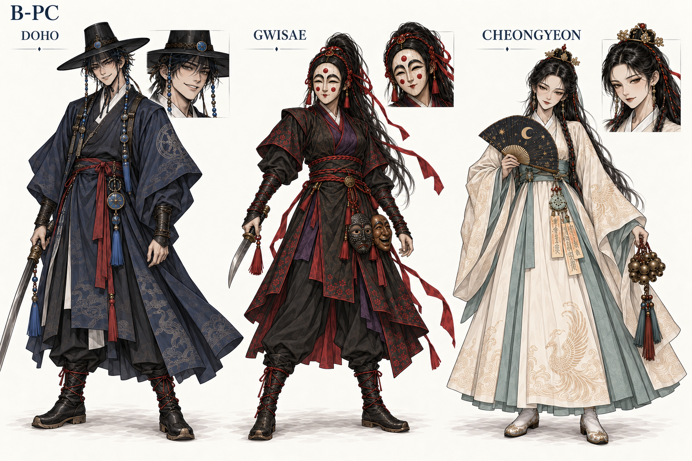
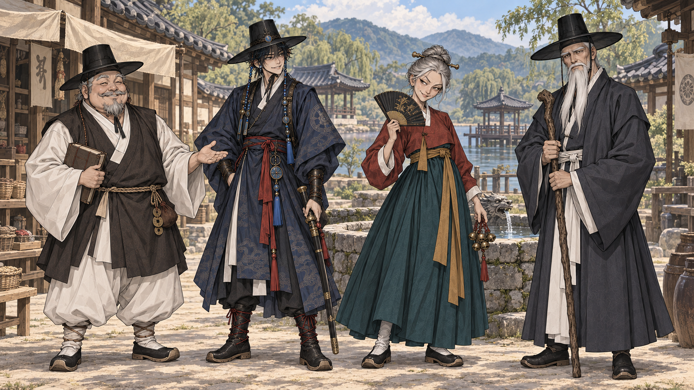

# NPC B 세트 기반 공통 화풍 확장 — 2026-09-17

PD: “B세트가 전체적으로 괜찮은데?” → 대상 확인 답변 **“이전 NPC 시트 — B1·B2·B3”**.
선호 기준은 [NPC B 원본](../npc-variants-2026-09-17/NPC_B_expressive.png) 전체다. 최근 S2 셀 애니형이나 제작자 제안 B1+C2+B3 혼합을 선택한 것이 아니다.

B1의 넉넉한 인상 / B2의 가는 얼굴과 능청스러움 / B3의 각지고 엄격한 인상을 살리고, **B 세트를 스타일 기준으로 주인공과 배경을 맞췄다**. D03는 복식·소품 참고로 사용하며 화풍을 우선하지 않는다.

| 결과 | 내용 |
|---|---|
| [B-PC](B_PC_trio.png) | 도호·귀새·청연 전신과 얼굴 비교 |
| [B-WORLD](B_WORLD_motgol.png) | B1·B2·B3와 도호, 못골 마을 통합 장면 |

## 검수와 상태

- **B-PC**: 도호·귀새·청연의 복식과 식별 소품을 유지하면서 B 세트의 가는 선·매트한 음영·성숙한 눈매로 맞춘 후보. 도호 검 끝이 왼쪽 프레임에 걸리고 작은 얼굴 인셋에서 모자가 잘리므로 무기/모자 전체 구조 제작 참조로는 쓰지 않는다. 의복 문양은 여전히 많다.
- **B-WORLD**: B1의 둥근 얼굴, B2의 가는 얼굴과 능청 미소, B3의 각진 얼굴과 엄격한 표정이 유지됨. 도호·NPC·배경에 선과 무광 명암을 공유. 배경은 채도/대비가 낮지만 석재·기와·식생의 디테일 밀도는 후속 축소 검수 대상. B2 부채의 펼친 무늬는 새 생성 디테일로 미확정.
- 내장 image_gen으로 2회/2장 생성. 실제 크기·복사 해시와 참조 이미지 경로는 manifest.json, 호출 전문은 PROMPTS.md에 보존했다.
- B 전체를 후속 탐색의 선호 방향으로 기록했다. 새 두 결과는 제작 후보이며 정본·게임 GLB 교체가 아니다. 신규 공식 D-번호를 부여하지 않았다.
- 캐릭터 시트는 화풍·표정·복식 비교용이다. 중립 자세·측후면·분리 소품과 3D 변환 검수는 별도 작업이다.

[전체 프롬프트](PROMPTS.md) · [manifest](manifest.json) · [생성 기록](generations.csv)

