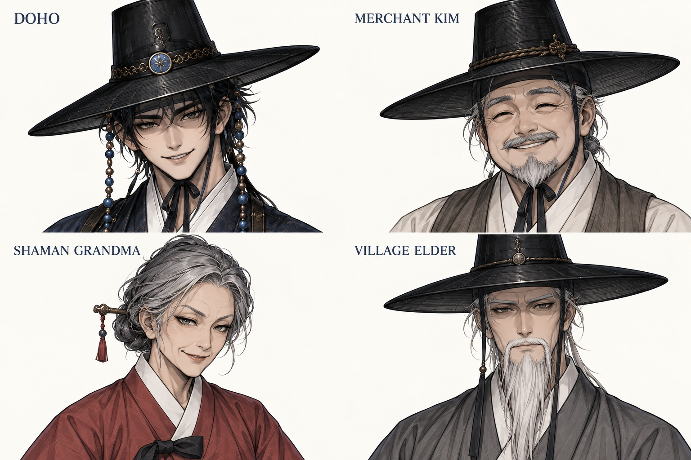
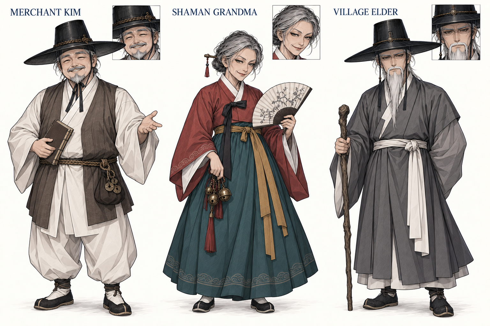
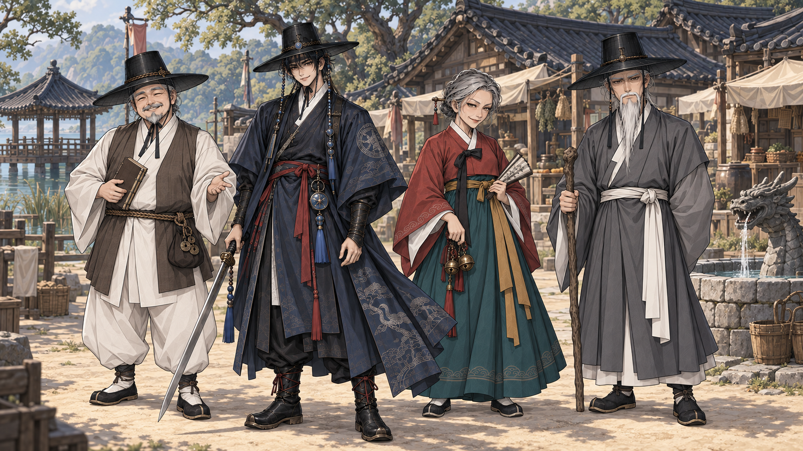

# NPC·PC 그림체 보정 — 2026-09-17

사용자 피드백에 따라 **도호 D03의 그림체를 기준으로 NPC 3명을 다시 그렸다**. 최종 검토 후보 3장. 기존 카탈로그와 게임 GLB는 교체하지 않았다.

## N01 — 얼굴 비교

기존 실사풍 NPC 이미지를 입력에서 제외하고 도호만 렌더링 기준으로 사용했다. 모자 상단이 일부 잘린 초상 비교용 그림이므로 흑립 전체 형태는 D03 원본/전신을 참조한다.

## N02 — NPC 전신

N01의 얼굴을 유지하면서 피부·손·옷주름을 동일한 선과 색면으로 전개했다. 상인·무당 할매·촌장의 역할색과 소품은 구분한다. 노년의 인상을 더 강하게 할지는 후속 검토 항목이며, 실사 피부 질감으로 되돌리는 방식은 피한다.

## N03 — PC·NPC·배경 통합 비교

보정한 NPC와 D03를 같은 조명 아래 놓았다. 배경은 기존 못골의 건축·구도를 참고하되 동일한 일러스트 재질을 목표로 다시 그렸다. 독립 마을/던전 배경 보정본이나 전체 23장 교체를 완료한 것은 아니다.

## 판정과 보존

- 렌더링 수정 후보이며 NPC의 새 얼굴을 정본으로 확정하지 않았다. D03/G02/C01/F01→F03 선택은 유지한다.
- 최초 [U01](archive/U01_mixed_style.png)은 이전 실사풍 NPC를 함께 참조한 통합 시도다. 사용자 재지적을 받아 후속 스타일 기준에서 제외했다.
- U01의 추가 편집 호출은 사용자 중단으로 완료 결과를 확인하지 못했다. 그 호출을 완료 산출물로 계산하지 않았다.
- 실제 얼굴·전신·통합 결과를 직접 확인하고 원본 복사 해시와 해상도·참조 경로를 기록했다. 색보정 필터만 적용한 결과가 아니다.

[전체 프롬프트](PROMPTS.md) · [원본·참조·해시 기록](manifest.json) · [공통 제작 기준](../../../art-direction/STYLE_BIBLE.md)

도구: 내장 GPT Image. 내부 모델 ID 미노출. 이번 3장 후보와 첫 통합 시도 1장을 독립 생성 목록에 보존한다.
