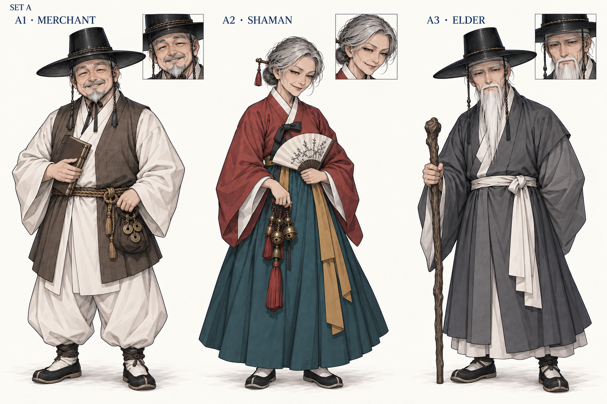
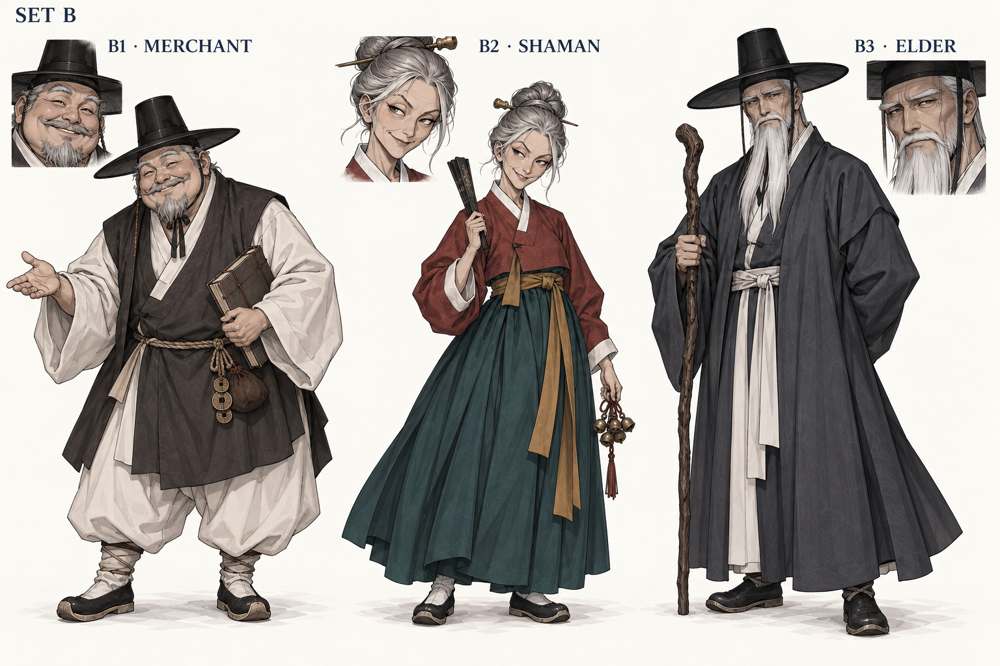
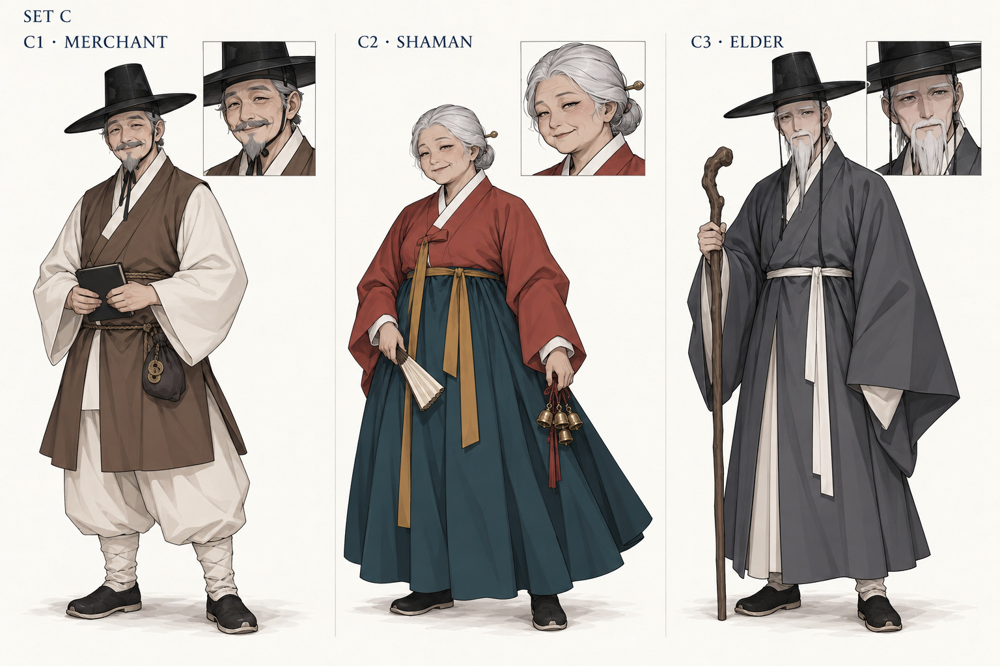

# NPC 추가 시안 — A/B/C

2026-09-17 · 도호 D03 그림체를 기준으로 세 시트, 인물별 총 9개 후보. 전부 미선택 후보이며 기존 정본·게임 자산을 교체하지 않았다.

| 방향 | 상인 | 무당 할매 | 촌장 | 차이 |
|---|---|---|---|---|
| A — 차분한 기준형 | A1 | A2 | A3 | 이전 보정본 N02에 가까운 정제된 얼굴·복식과 차분한 자세 |
| B — 개성·표정형 | B1 | B2 | B3 | 둥글고 붙임성 있는 상인 / 가늘고 능청스러운 할매 / 각지고 묵직한 촌장 |
| C — 간결형 | C1 | C2 | C3 | 잔선·문양을 줄이고 큰 색면과 주요 옷주름으로 정리 |

세트 전체 또는 인물별 혼합 선택 가능. **제작자 추천은 B1 + C2 + B3**이며 사용자 선택으로 기록하지 않았다.

## A

## B

## C

## 확인 사항

- 도호 D03는 새로 디자인하지 않고 공통 그림체 참조로 유지했다. 기존 실사풍 NPC는 입력에 사용하지 않았다.
- A는 N02의 얼굴/복식을 많이 유지한다. B/C는 D03만 스타일 입력으로 사용해 다른 얼굴·자세·선 밀도를 탐색했다.
- 전신 모자·신발·소품과 후보 번호를 직접 확인했다. 작은 얼굴 인셋은 의도된 초상 크롭이며 전체 모자 구조는 전신/원본을 참조한다.
- C의 작은 크기 가독성은 제작 의도다. 실제 게임 모델이나 게임 화면에서 시험한 결과가 아니다.
- 역할·소품·노년 정체성은 유지하되 연령 인상과 얼굴은 후보 간 차이가 있다. 선택 후 혼합 세트의 선·명암 밀도를 다시 맞출 수 있다.

[전체 프롬프트](PROMPTS.md) · [원본·참조·SHA256·해상도](manifest.json) · [이전 보정본](../npc-style-alignment-2026-09-17/README.md)

도구는 내장 GPT Image이며 내부 모델 ID는 미노출이다.
