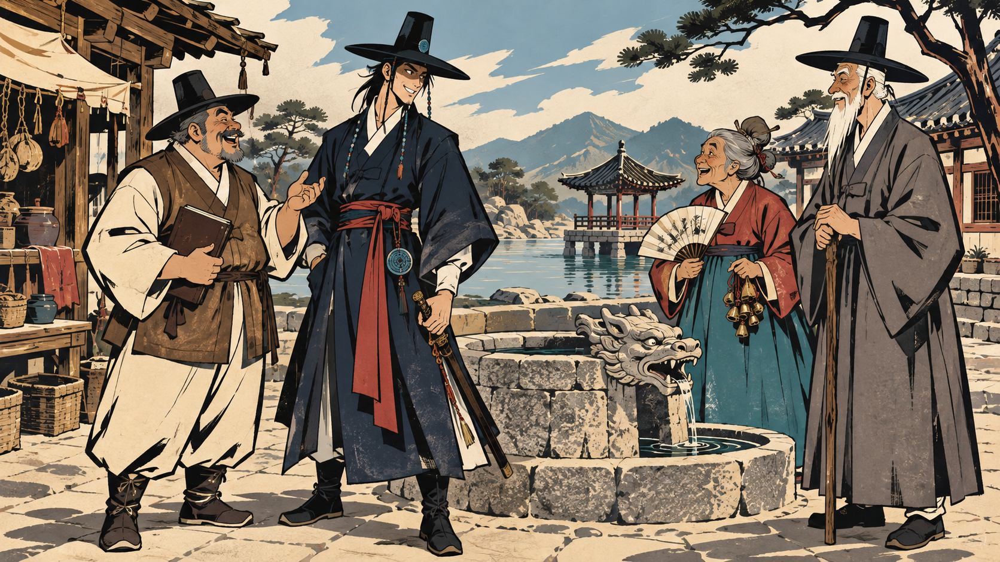
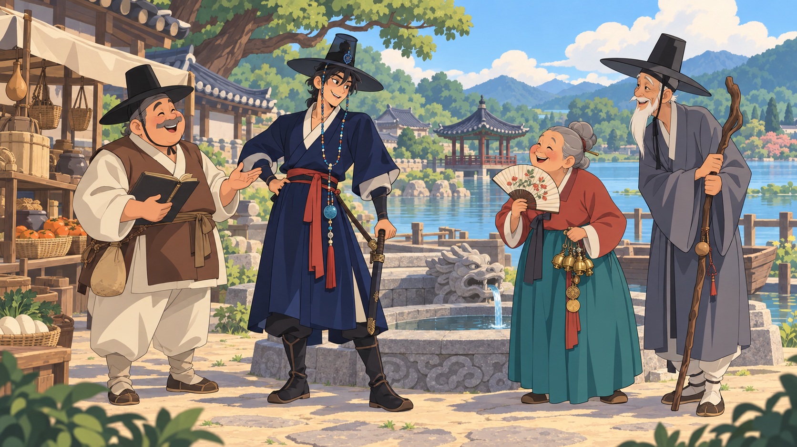
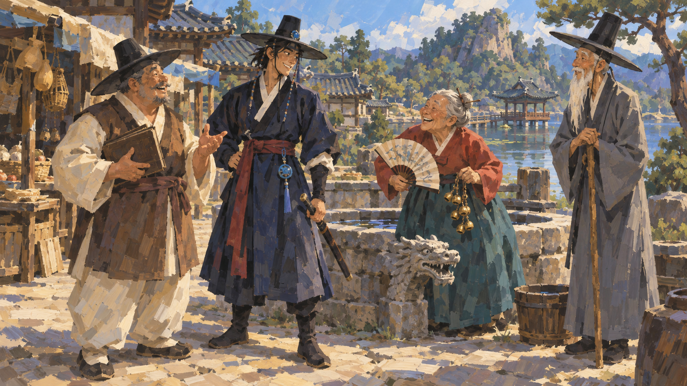

# PC·NPC·배경 공통 화풍 재탐색 — 2026-09-17

사용자 지시: “주인공 스타일을 앵커로 안잡아도 되니까 변화를 좀 줘봐”

도호의 기존 그림체를 고정하지 않고 **도호 + NPC 3인 + 못골 배경**을 함께 새로 그린 세 방향이다. 캐릭터 역할·조선풍 복식·식별색은 문장으로 유지했으며, 기존 그림은 입력하지 않았다. 선·얼굴 비례·채색·재질 처리가 한 장면 안에서 함께 달라지는지 비교한다. 같은 장소/등장인물로 비교하되 생성 결과의 정확한 구도는 다르다.

| 코드 | 방향 | 확인할 차이 |
|---|---|---|
| [S1](S1_ink_graphic.png) | 먹선 그래픽형 | 각진 얼굴, 굵은 먹선, 강한 그림자 덩어리, 제한색 |
| [S2](S2_warm_cel.png) | 따뜻한 셀 애니형 | 둥근 얼굴, 밝은 색, 단순한 셀 명암, 친근한 모험 톤 |
| [S3](S3_painterly_gouache.png) | 거친 붓질형 | 윤곽선 대신 색면, 인물·옷·석재·수목에 공통 큰 붓질 |

## 검수

- **S1**: 각진 얼굴·굵은 먹선·제한색이 인물과 건축에 함께 적용됨. 출력은 요청보다 종이와 석재 질감이 많으므로 선택 시 밀도 조정 대상.
- **S2**: 둥근 NPC 얼굴·명료한 셀 그림자·밝은 색으로 구분됨. 도호도 얼굴 비례와 선이 달라졌으며 배경은 인물보다 세밀해 후속 단순화 가능.
- **S3**: 인물·옷·돌·수목에 같은 큰 붓질이 적용됨. 윤곽선 의존도가 낮고 회화성이 강함. 축소 시 얼굴·재질 정보가 뭉칠 수 있어 선택 후 아이소 크기 검수가 필요.
- 세 장 모두 도호와 NPC 3인의 역할, 검·부채·장부·지팡이, 조선풍 마을을 확인했다. 선·채색 방식 비교용이며 세부 장신구/얼굴은 확정본이 아니다.
- 내장 image_gen으로 각 1회 생성. 요청은 16:9·가로 약 1600px. 실제 크기와 SHA-256은 manifest.json에 기록한다. 모델 ID와 비용은 도구가 노출하지 않아 단정하지 않는다.
- 후보 3장과 전체 프롬프트를 보존했다. S1/S2/S3 사용자 선택 전. 기존 D-068 외형 정본 및 게임 GLB 변경 없음.
- 다음 제작은 사용자가 고른 화풍을 얼굴 비교·주인공 3인방·구미호·던전으로 확장하는 단계다. 아직 실행하지 않았다.

## 파일

- [전체 프롬프트](PROMPTS.md)
- [생성·검수 메타데이터](manifest.json)
- [이 작업의 생성 목록](generations.csv)

