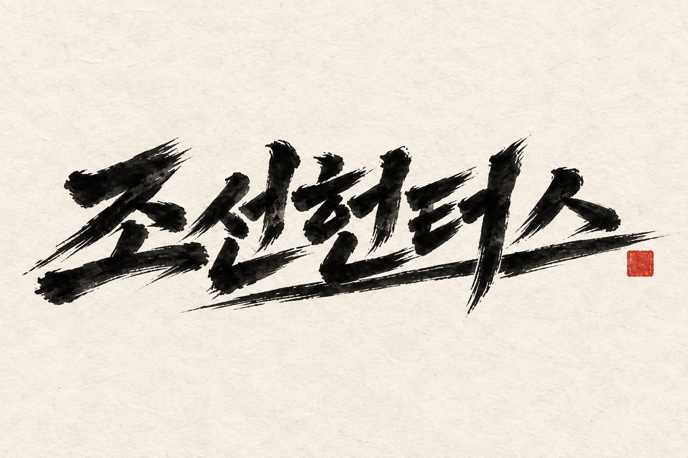

# 조선헌터스 공식 메인 타이틀 에셋 — 먹 2종

2026-10-06 PD가 #669 2차 시안 **1번 농묵·2번 갈필을 모두 메인 에셋으로 채택**했다. 오프닝 시네마틱, 타이틀 화면, 각종 마케팅에 사용한다.

| 에셋 | 파일 | 바탕·용도 |
|---|---|---|
| 농묵 · 묵직한 장단 | [title_nongmuk_v1.png](title_nongmuk_v1.png) | 밝은 한지 위 검은 먹. 밝은 타이틀 카드·인쇄·홍보 |
| 갈필 · 빠른 잔심 | [title_galpil_v1.png](title_galpil_v1.png) | 검은 바탕 위 상아색 갈필. 어두운 오프닝·타이틀·홍보 |

두 PNG는 1536×1024, 배경 포함 RGB 공식 원본이다. 후보 원본과 SHA256·바이트가 동일하다. 로고만 겹칠 때는 이 마스터에서 별도 버전의 투명 파생본을 만들고, 마스터는 덮어쓰지 않는다. 출력 크기·비율·안전 여백에 맞춘 파생본도 별도로 관리한다. 영상의 정확한 제목은 생성 모델에 새로 그리게 하지 않고 후반 합성으로 이 원본의 글자 형태를 유지한다.

승인 원문·파일 해시·범위 = [approval_2026-10-06.json](approval_2026-10-06.json), 전체 프롬프트 = [prompts.json](prompts.json) 및 prompts/의 두 txt. 원래 생성 기록 = workbench/production/title_669_ink/. 공식 참조 세트 = title_ink_2026_10_06 (art-direction/manifests/reference-sets.yaml). 게임 쪽 사용 정본 = docs/design/title_brand_assets.md.

이 보관은 메인 브랜드 마스터 채택이다. 현재 #545 실행 타이틀의 로고 파일은 별도 연결·검수 전까지 유지한다.
