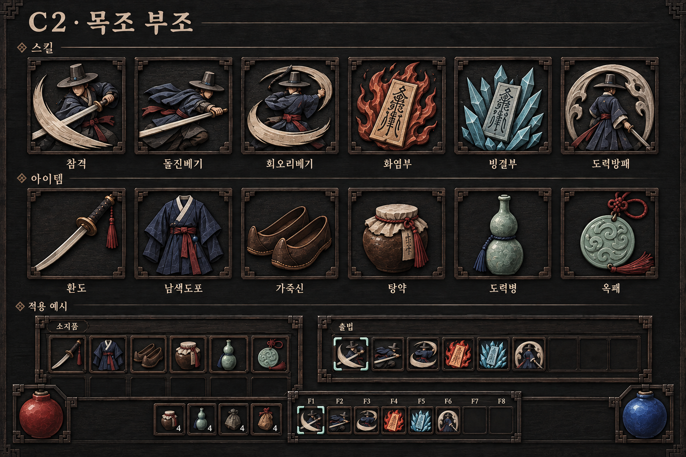
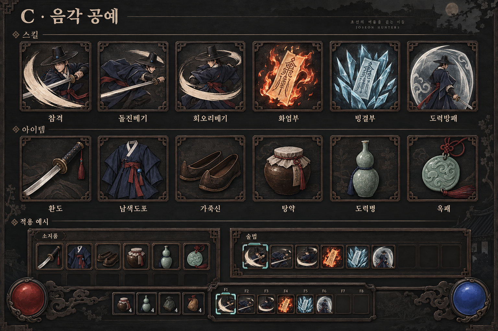

# #393 — UI·스킬/아이템 아이콘 시안

AI 생성 목표 시안이며 실제 게임 캡처가 아니다. A·B·C2는 후보, C1은 재질 보완 전 초안이다. PD 방향 선택 대기.

## A · 채색 원화

## B · 먹판 삽화

## C2 · 목조 부조

## C1 · 보존한 초안

[정본·프롬프트·참조·검수](../../../workbench/production/ui_icon_redesign_2026-09-23/README.md)
