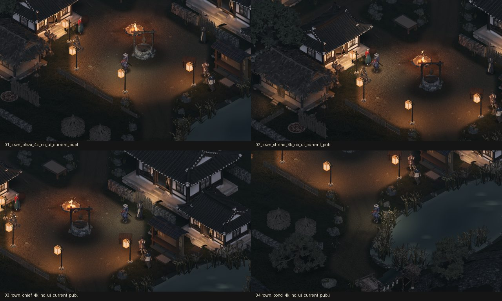
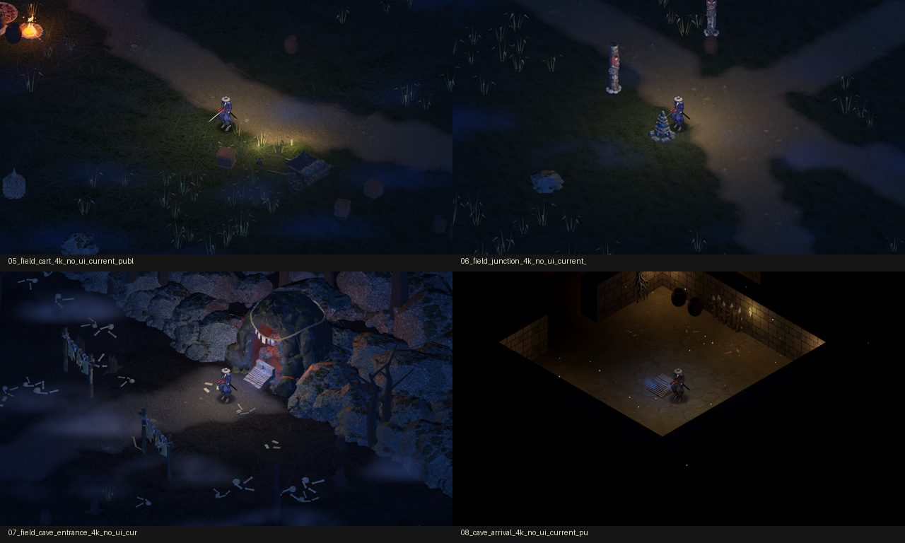
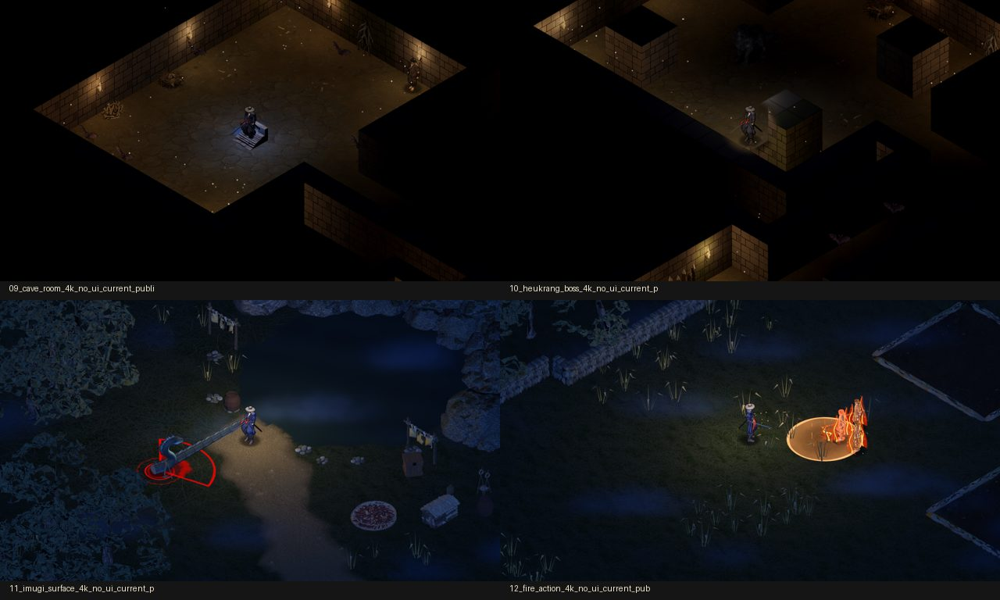
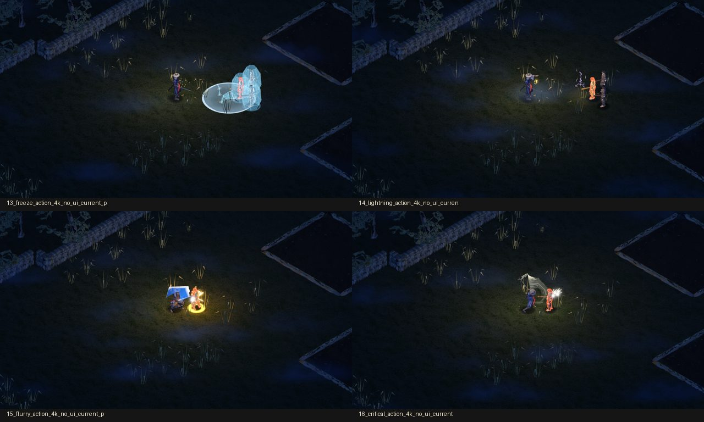

# 조선헌터스 SNS 자료 · 2026-10-10

공개 홍보용 패키지 · 게임 카드 [#721](https://github.com/genesiskoo/joseon-hunters/issues/721). 모든 인도 파일의 공개 여부·스포일러·확정/후보 상태를 [manifest.csv](manifest.csv)와 [manifest.json](manifest.json)에 표시했습니다. 파일명에도 원본의 상태를 표시했습니다. 공개 저장소에는 허용된 자료만 포함했습니다.

## 원본 다운로드

[날짜별 GitHub Release](https://github.com/genesiskoo/joseon-assets/releases/tag/marketing-2026-10-10)에 원본 5묶음이 있습니다. ZIP 안의 파일도 `marketing/2026-10-10/` 아래에 들어 있습니다. ZIP들을 같은 루트에 풀면 날짜 폴더로 모입니다. 저장소에는 안내·대응표·작은 미리보기를 둡니다.

| 묶음 | 압축 크기 | 원본 파일 수 |
|---|---:|---:|
| [art](https://github.com/genesiskoo/joseon-assets/releases/download/marketing-2026-10-10/joseon-hunters-2026-10-10-art.zip) | 89.9 MiB | 37 |
| [audio](https://github.com/genesiskoo/joseon-assets/releases/download/marketing-2026-10-10/joseon-hunters-2026-10-10-audio.zip) | 87.9 MiB | 246 |
| [screenshots](https://github.com/genesiskoo/joseon-assets/releases/download/marketing-2026-10-10/joseon-hunters-2026-10-10-screenshots.zip) | 137.8 MiB | 16 |
| [video-ui-off](https://github.com/genesiskoo/joseon-assets/releases/download/marketing-2026-10-10/joseon-hunters-2026-10-10-video-ui-off.zip) | 126.5 MiB | 15 |
| [video-ui-on](https://github.com/genesiskoo/joseon-assets/releases/download/marketing-2026-10-10/joseon-hunters-2026-10-10-video-ui-on.zip) | 120.8 MiB | 15 |

압축 전체 해시는 [SHA256SUMS.txt](SHA256SUMS.txt), 크기와 다운로드는 [release_archives.json](release_archives.json)에 있습니다. ZIP의 art/audio README·대응표는 저장소 문서와 같습니다. 개별 원본은 manifest의 `archive`를 내려받아 `path`에서 찾으세요.

이 구조는 날짜별 검토와 큰 원본 보존을 함께 만족시키기 위해 채택했습니다. 큰 미디어를 모두 git에 직접 넣는 방식은 기존 보존 규칙(파일 10MB 이상 또는 카드 원본 합 50MB 이상은 Release)과 커밋 검사를 넘기므로 사용하지 않았습니다. 같은 저장소의 Release에 원본을 두고 날짜 폴더와 ZIP 내부 경로·해시로 연결합니다.

## 아트·표정

[아트 안내와 미리보기](art/README.md) · [표정 보유 대응표](art/portrait_availability_public_spoiler-none.csv)

- 확정 투명 초상 7장: 도호 기본·진지·능청, 김 영감 기본·웃음, 억쇠 기본·웃음. 모두 원본 1024×1536 PNG입니다.
- NPC 후보 12장: 촌장 기본·웃음, 무당 할매 기본·진지, 주모 기본·웃음의 A/B, 원본 1024×1536 RGBA입니다. 잔상·알파 품질 문제가 있는 미승인 후보로 표시했습니다. 확정 NPC idle 첫 프레임 5장은 480×864 보충 자료입니다.
- 주모는 평상복 대화 초상만 제공합니다. 놀람·화남·입 벌림 전용 프레임은 현재 없습니다.
- 못골·던전 컨셉아트 7장, 키 비주얼·타이틀 배경 2장, 투명 로고 2장(한글 확정·한글/영문 결합 후보), 배경을 포함한 공식 먹 브랜드 마스터 2장입니다. 영문 단독 확정 로고와 최신 먹 마스터의 투명 파생본은 없습니다.
- 키 비주얼의 동료 캐릭터는 플레이어 클래스 수를 뜻하지 않습니다. EA 플레이어는 도호 1명입니다.

## 영상·4K 스크린샷

[영상 대응표](video/clips_public.csv) · [스크린샷 대응표](screenshots/screenshots_public.csv) · [재현 도구·촬영 조건](capture_tools/README.md)

영상은 원생성 1920×1080, 60fps, 게임 오디오 포함 MP4 30개입니다. UI 켬·끔으로 같은 12트랙을 각각 녹화했고, 동굴·드랍·보스 트랙은 장면을 나눠 각 버전 15개씩 제공합니다. 해상도·실제 프레임률·오디오 스트림과 가청 음량·전체 디코딩·E2E 성공을 검사했습니다. UI를 끈 버전은 대화·식별 GUI도 보이지 않으므로 설명을 읽히려면 UI 버전을 사용하세요.

| 요청 장면 | 트랙 | 포함 내용 |
|---|---|---|
| 마을 대화·수락·완료 보고 | quest_accept, quest_report | 새 성우가 대사를 끝까지 말한 뒤 진행, 의뢰 일지 수락·완료 |
| 흑랑 굴 1층 | cave | 진입·실제 1층 전투 2클립 |
| 연속 베기·부적 불/한기/벼락·빙결·치명타 | effect_flurry, effect_fire, effect_cold, effect_lightning, effect_crit | 현재 에셋의 고정 표적 시연, 한기와 빙결·금빛 치명타 |
| 드랍 빛기둥·미식별 아이템 식별 | loot | 등급별 준비 아이템 드랍·줍기, 식별 과정 2클립 |
| 보스전·적 공격 예고 | boss | 돌진 예고·전투 하이라이트 2클립 |
| 착륙한 평타 속도 | attack | #693 적용 후 현재 평타 연결, 촬영용 타이밍 변경 없음 |
| 이무기 수정본 | imugi | #710 적용 후 자연 잠수·재등장 흐름 |

촬영 소스는 게임 `627061d8021ce3013afae09f3c1cc1abaccc858a`, 아트/음악의 원천 저장소 기준은 `33ee992580a404ae61e728d120c6d308da5067db`입니다. 원본 에셋을 수정하지 않았습니다. 캐릭터·스킬·물약·드랍은 촬영용으로 준비하고 자동 입력과 게임 API로 조작합니다. 기존 E2E의 명중 확정 설정을 사용하므로 일반 명중 확률을 보여주는 자료는 아닙니다. 보스의 돌진 대기를 초기화하고, 이펙트 시연은 정지한 표적과 촬영용 피해·치명타 설정을 사용합니다. [상세 조건](capture_tools/MARKETING_CAPTURE_SPEC.md)을 함께 제공합니다. 영상은 현재 게임 렌더이며 실시간 성능 측정이 아닙니다.

4K 무UI PNG 16장은 원생성 3840×2160입니다. 못골 4, 필드 3, 동굴 2, 흑랑 조우 1, 이무기 1, 이펙트 시연 5장입니다. 이름표와 디버그 표식도 렌더에서 제외했습니다. 12–16번은 **현재 에셋 이펙트 시연 / 고정 표적 연출 캡처**로 설명하세요. 10번은 어두운 조우 분위기용 정지 장면이고, 16번은 밝은 치명타 섬광이므로 대표 썸네일 선택 시 대응표 메모를 참고하세요.

## 음성·사운드

[오디오 안내](audio/README.md) · [음성/대사 대응표](audio/voice_lines.csv) · [효과음 용도](audio/sfx_cues.csv) · [Suno 곡명/장면/출처](audio/bgm_tracks.csv)

PD 선택에 따라 새 성우 확정 237개 중 초반 공개용 **196개**만 포함했습니다. 보호 대상 41개의 파일명·대사는 싣지 않았습니다. 억쇠의 정적 음성은 아직 없고 현재 추가 대본 18줄도 음성 미제작 상태입니다. 효과음 WAV는 베기·부적·빙결·치명타·드랍·UI 등 44개입니다. Suno 원본은 승인된 던전 5곡과 판소리 오프닝 「못골에 깃든 것」 1곡이며 변환하지 않은 MP3/M4A입니다. 다른 제공자 음악을 Suno로 표시하지 않았습니다.

## 영문·착륙 메모

[영문 소개](english_copy_public_spoiler-none.txt)에 한 줄 소개, 짧은 문단, 핵심 특징 5개를 넣었습니다. 프로젝트 방향에 맞춘 영문 초안입니다. 확인된 공개 Steam 상품 링크는 아직 없어 위시리스트 URL을 만들지 않았습니다.

[플레이어 체감 변경 메모](player_changes_public.csv)는 최근 착륙 8건을 한두 문장으로 기록하며 개발 수치를 제외했습니다. 이후 게임 착륙 때도 날짜별 표를 갱신하도록 `marketing/README.md`와 저장소 운영 지침에 반영했습니다.

## 파일별 표시 읽는 법

`public_allowed=true`는 이 공개 패키지에서 홍보에 사용할 수 있다는 뜻입니다. `approval_status`의 candidate는 디자인 후보, confirmed는 확정 원본, current_game_capture는 현재 게임 촬영, english_draft는 영문 초안을 뜻합니다. 원본의 크기·알파 상태도 개별 행에서 확인할 수 있습니다. Git에 보관된 원본은 커밋의 blob 해시까지 대조했습니다. Git 밖에 보관하던 승인 컨셉아트와 Suno 원본은 SHA-256으로 식별하며 `source_context_commit`은 작업 시점의 저장소 기준을 뜻합니다.

`spoiler`: none(일반), minor_quest(초반 의뢰 결과), minor_enemy(보스·이무기 연출), minor_setting(후반 장소), opening_premise(오프닝 설정), mixed_see_manifest(여러 등급을 담은 안내/묶음). 스포일러 없는 게시물에는 none 파일만 고르세요. CSV 원천 대응표의 하이픈 표기는 manifest의 밑줄 표기와 같은 등급입니다.

manifest 자체는 순환 해시를 피하기 위해 SHA를 비워 두며, 나머지 개별 파일과 ZIP에는 SHA-256을 기록합니다. 공개 원본/미리보기·안내·CSV·재현 도구까지 색인에 포함합니다. © 2026 KOOSHA studio.
