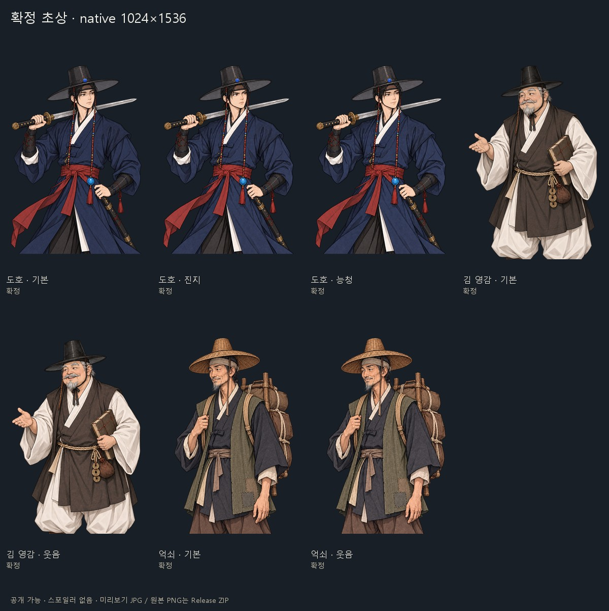
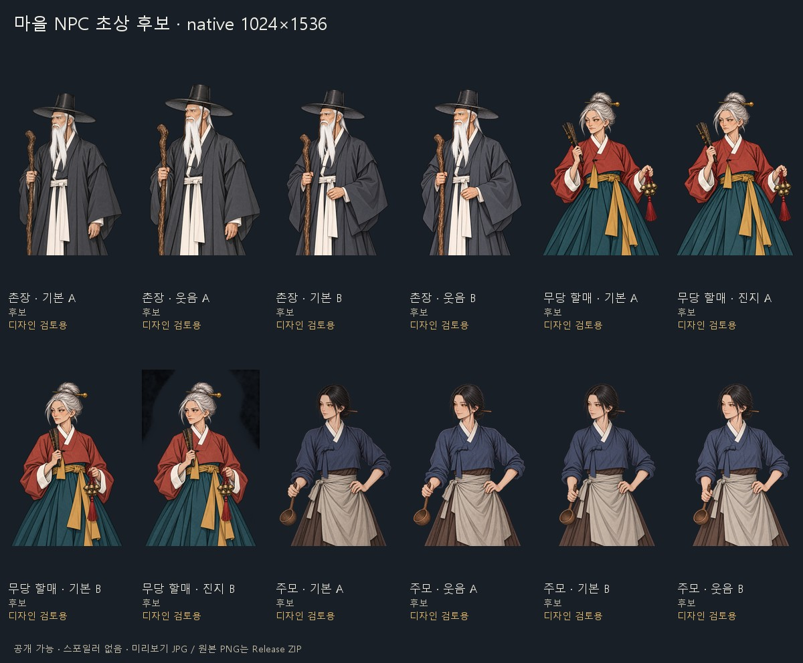
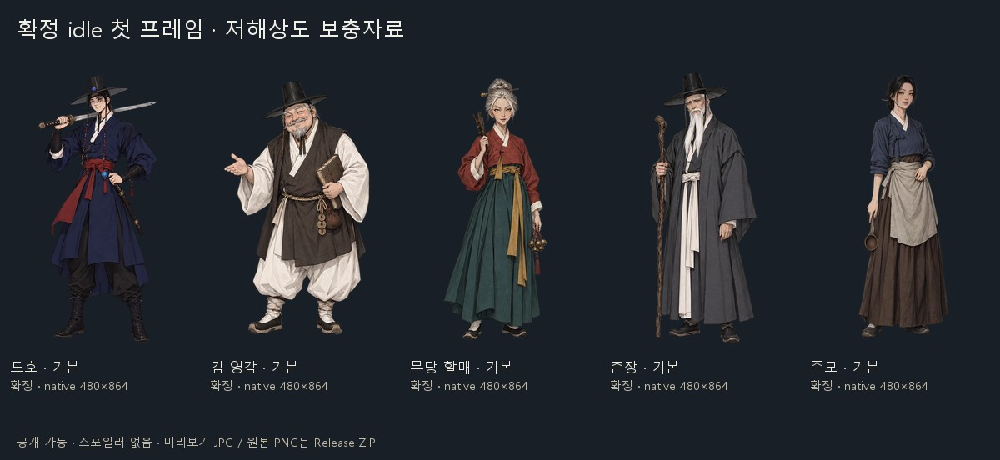
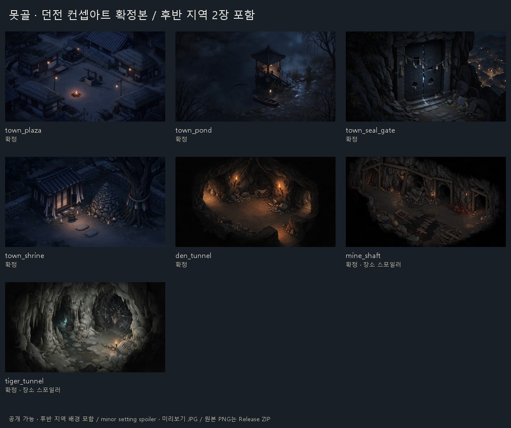
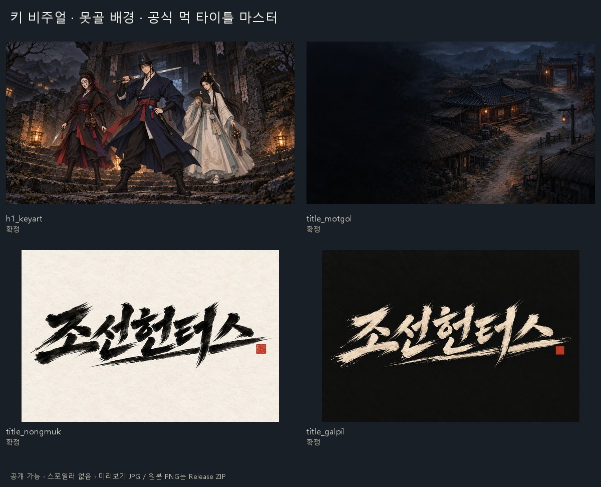
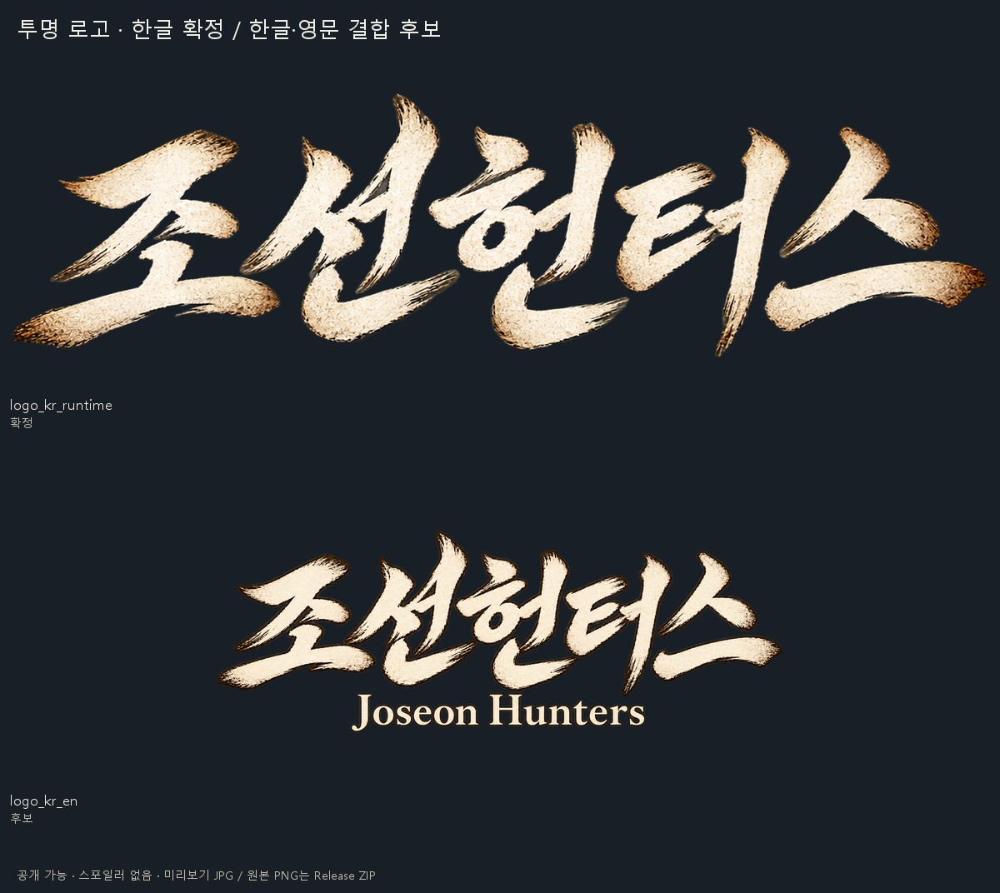

# 조선헌터스 SNS 아트 자료 · 2026-10-10

PNG 원본은 같은 날짜의 상위 README에 연결된 **art ZIP GitHub Release**에서 내려받습니다. 이 폴더에는 빠른 검토용 JPG 6장과 캐릭터별 표정 대응표를 둡니다.

모든 원본 PNG는 복사 전후 SHA-256이 같습니다. 새 원화를 생성하거나 원본의 알파·색·크기·글자를 고치지 않았습니다. 파일명에 확정/후보, 공개 가능 여부, 스포일러 등급을 표시했습니다. 후보는 확정본으로 사용할 수 없으며, 장소 스포일러 표시는 후반 지역 배경을 뜻합니다.

| 원본 묶음 | 실제 보유 내용 |
|---|---|
| cutouts/confirmed | 도호 기본·진지·능청, 김 영감 기본·웃음, 억쇠 기본·웃음: 7장, native 1024×1536 투명 PNG |
| cutouts/candidate | 촌장 기본·웃음, 무당 할매 기본·진지, 주모 기본·웃음의 A/B 후보: 12장, native 1024×1536 RGBA |
| supplements/low_resolution | 도호·김 영감·무당 할매·촌장·주모의 확정 idle 첫 프레임: 5장, native 480×864 투명 PNG |
| backgrounds | 못골 광장·연못·봉인문·서낭당, 흑랑 굴 통로: 5장. 쇠부리 폐광·범굴 통로: 2장, minor_setting 표시 |
| illustrations | 캐스트 키 비주얼, 못골 타이틀 배경: 2장 |
| logos | 한글 확정 투명 로고 1장, 한글·영문 결합 투명 로고 후보 1장 |
| brand_masters | 농묵·갈필 공식 브랜드 마스터 2장. 배경 포함 RGB이며 투명 로고 파일이 아님 |

12장 NPC 후보는 알파 최대 254이고 일부 배경 잔상·표정 구도 문제가 있어 게임 반입에 합격하지 못한 디자인 검토용 자료입니다. 주모 후보 4장은 평상복 차림의 대화 초상입니다. 확정 주모 첫 프레임은 저해상도 보충 폴더에 따로 있습니다.

놀람·화남·입 벌림 전용 프레임은 현재 없습니다. 도호의 능청 표정과 할매의 진지 표정은 이름 그대로 제공하며, 웃음이나 화남으로 바꾸어 세지 않았습니다. 자세한 30칸 현황은 [표정 보유 대응표](portrait_availability_public_spoiler-none.csv)를 보세요.

키 비주얼에는 도호·귀새·청연이 함께 등장합니다. **EA에서 플레이할 수 있는 캐릭터는 도호 1명**입니다. 새 공식 먹 타이틀 마스터의 투명 파생본과 영문 단독 확정 로고는 아직 없습니다.

## 미리보기

© 2026 KOOSHA studio. Public marketing material. Portrait design candidates are labeled; later-location art is tagged minor setting spoiler.
