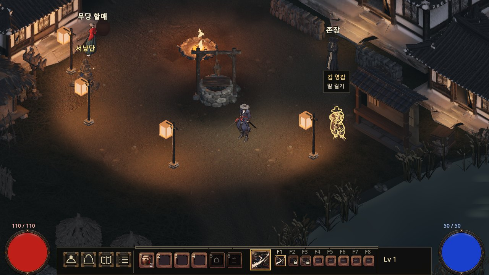
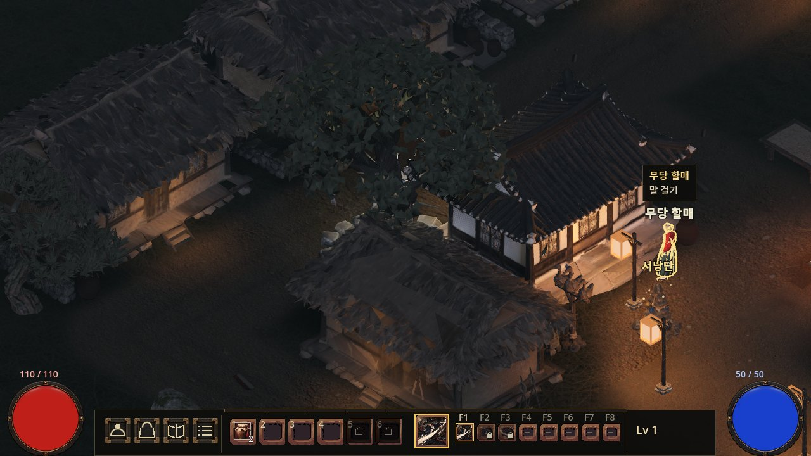
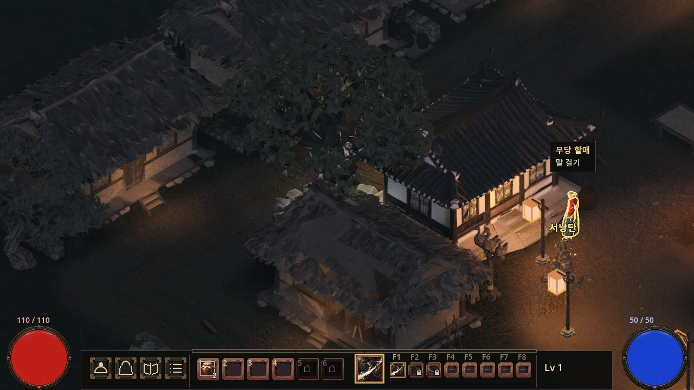
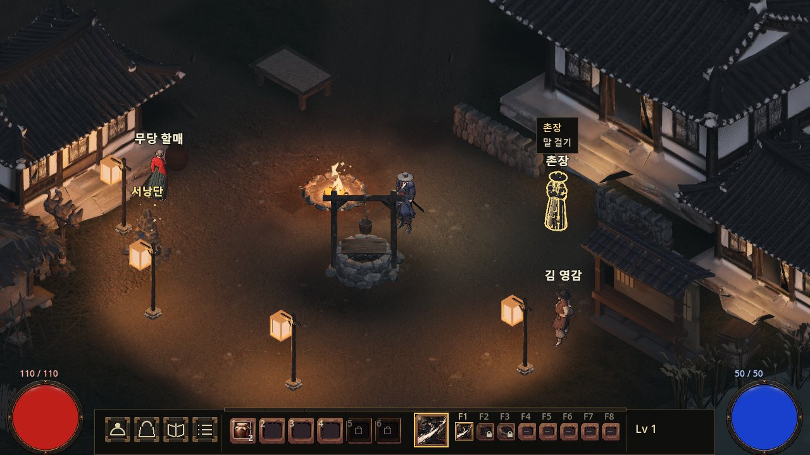
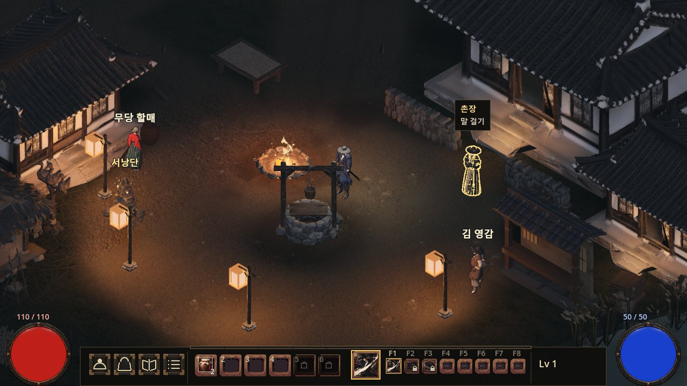
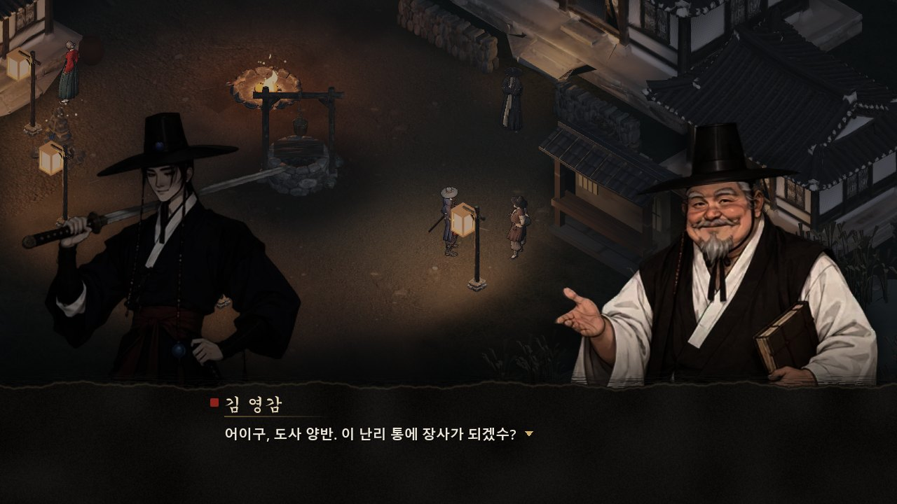
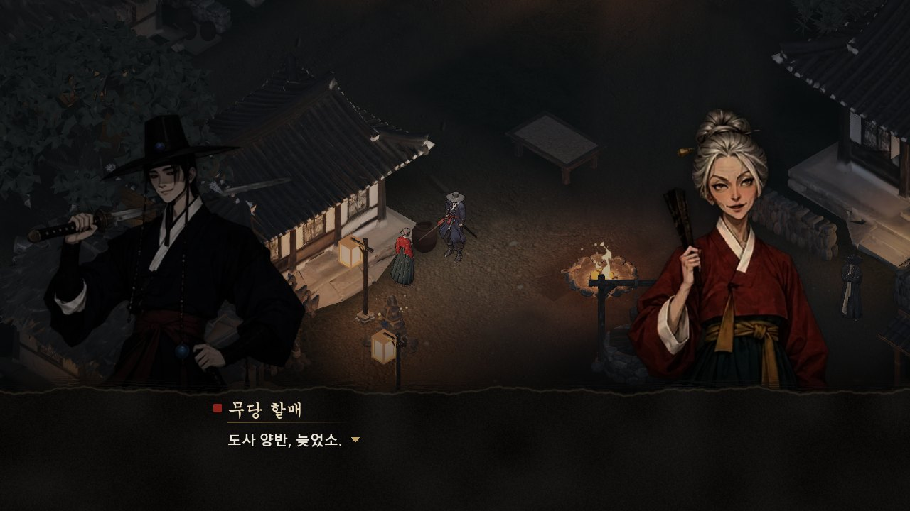
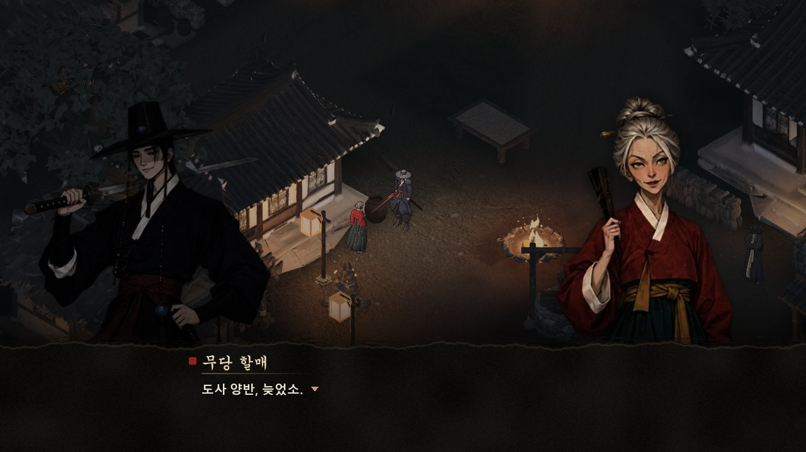
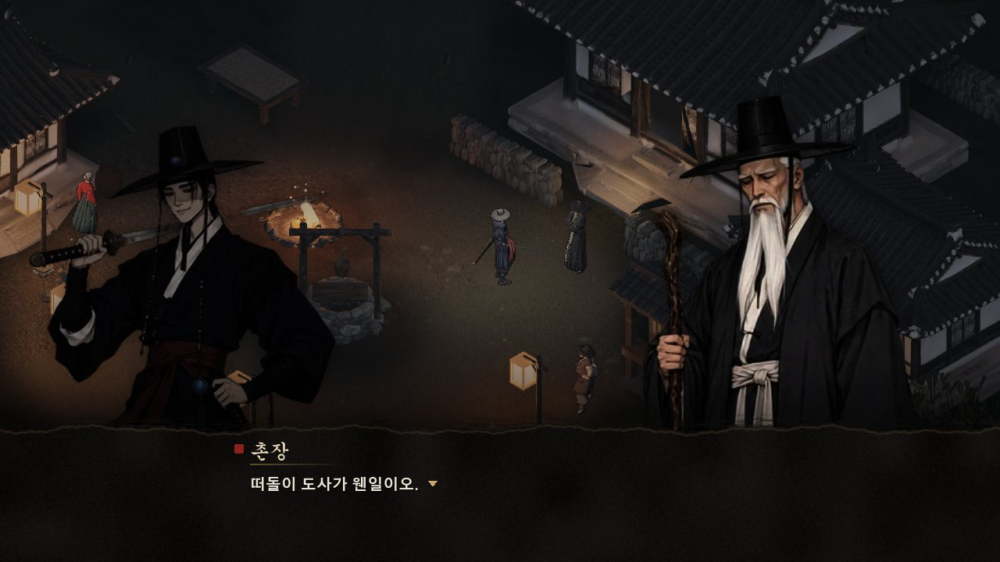
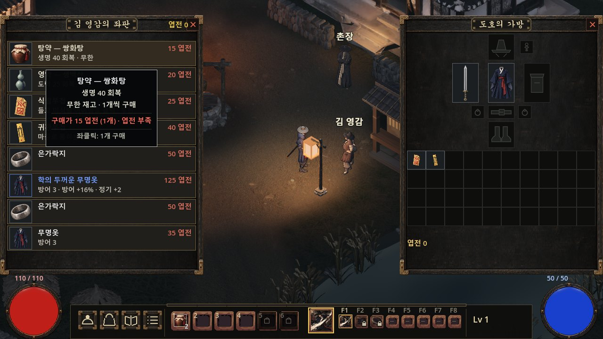

# #110 최신 NPC UI 실제 게임 검수

수정 전 메인830b090d / 코드 후보 `5d3b7a34` / 2026-09-27. Npc 이름표 표시와 대화의 기존 transparency 복원을 검수한다. 같은 카메라·이동 가능한 배치·실제 클릭으로 촬영했다.

단위 52종·도구 검사 PASS. 창 모드 e2e 9/9·총394검사 PASS. 부팅 SCRIPT ERROR0·오토로드10/10·주 장면OK·러너 자기검사5/5 PASS.

| 상태 | 수정 전 | 후보 |
|---|---|---|
| merchant_hover |  |  |
| shaman_hover |  |  |
| elder_hover |  |  |
| merchant_dialogue |  |  |
| shaman_dialogue |  |  |
| elder_dialogue |  |  |
| merchant_shop |  |  |

게임 저장소 docs/art/110_hover_clarity에는 NPC3 전후6장만 보관한다. 이 보고서의14장은300KB 이하 JPG이며 verification.json에 해시와 검사 범위를 적었다. 후보는 PD 확인 전 메인에 반영하지 않았다.
