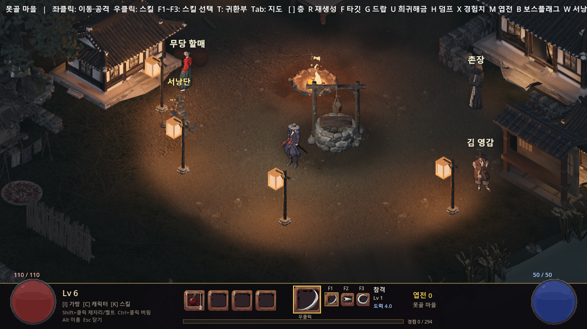
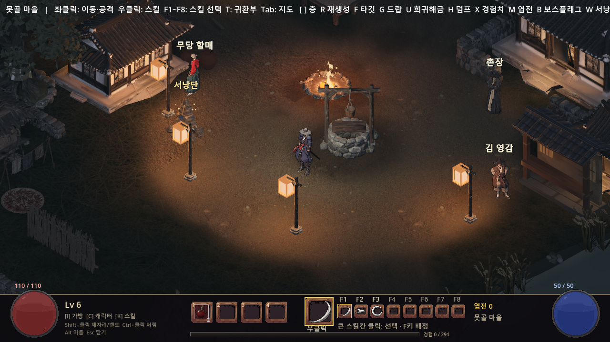
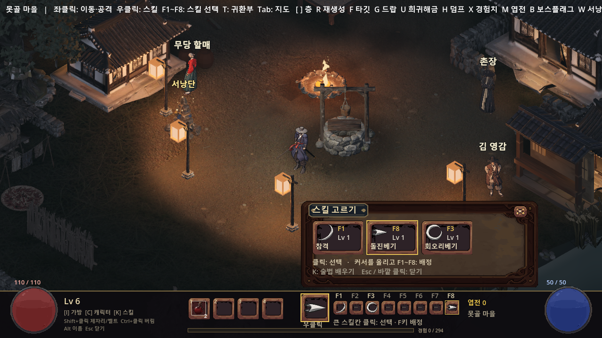
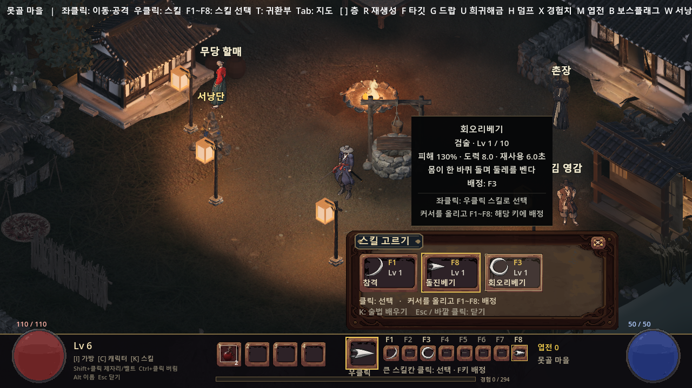

# #245 — 스킬 고르기 / F1~F8

작업 트리 `codex/245-skill-picker`, 기준 main `1a352d691f260a401fb128f2e8c03a5c159eaa2c`. UI 변경은 PD 확인 후 착륙한다. 새 이미지 생성 비용 0.

## 보이는 변화

| 수정 전 | 수정 후 |
|---|---|
|  |  |

동일 `skill_icons` 대본의 못골·1280×720·카메라 고정 화면. 배경·NPC·스킬 원화는 변경하지 않았다. 독립 실행이라 캐릭터 대기 자세·불꽃 프레임은 다르다.

큰 스킬칸 좌클릭 → 배운 액티브만 표시. 스킬 좌클릭 → 현재 우클릭 스킬로. 스킬 위에 커서를 두고 F1~F8 → 배정(옛 칸은 비움). 배정은 스킬을 시전하거나 학습 포인트를 쓰지 않는다. K는 기존 술법 학습창이다.

## 검증

- 수정 전 `skill_icons`: 48검사 PASS, 원시 로그 `before_skill_icons.raw.log`.
- 수정 후 `skill_icons`: 48검사 PASS. 잠금·학습·F 선택·미니 클릭·쿨다운·도력·최대 레벨·세 탭 유지.
- 최종 창 모드 `skill_picker`: **132검사 PASS**, Godot 종료 0. F1~F8 배정·중복 이동·덮기·미학습 예약·빈 키·세이브 이어하기·Esc/K/I·가방 커서·바깥 좌우 클릭·키 유지/키 반복/동일 프레임 닫기·페이지 경계·실제 사망/타이틀/새 게임 검사. 카메라 이동 없음.
- 1280×720 / 1600×900 / 1920×1080 실렌더 치수, 화면 밖/하단바/선택지 덮음 확인. 6칸 벨트와 스킬칸 충돌 없음.
- backend 단위 `PROGRESSION_TEST`, `SAVE_TEST`: PASS, 종료 0. `backend_*.raw.log`.
- 전체 회귀: **단위 30종 · 도구 12종 · 러너 자기검사 5/5 · 최종 전체 E2E 46/46 PASS**. 최종 종료 코드 0. 최초 전체는 45/46(verify_flows 공격 중 표적의 hit 기대); fixture의 AI 정지·IDLE 및 실제 피해 확인을 추가한 뒤 단독 15검사와 전체 재실행을 통과했다. 최초 실패(exit 1)도 logs에 보존. 원시 Godot 로그 48개에서 의도된 오류 검사(러너 자기검사·던전 지도 거부 3건)를 제외한 SCRIPT ERROR / ERROR 0.

## 범위와 구조

`Progression.assign_hotkey` 한 곳에서 배정 가능 여부와 중복 이동을 검증한다. 저장은 기존 `character.hotkeys` 문자열 8칸, 버전 변경 없음. 일반 마우스 캡처와 별개인 F키 캡처를 두어 가방 위에서 F키로 선택하는 기존 동작을 보존한다. 전투는 캡처 동안에도 이전 키 상태를 갱신하고, 해제 프레임까지 보호해 닫힌 뒤 누른 키가 새 선택으로 새지 않는다.

공통 PanelUi/UiSkin/Tooltip을 재사용한다. 선택창은 4열·최대 24개씩 페이지, 테두리 안쪽 여백24px, 새 글자14px 이상. UI가 스킬/클래스 ID를 정하지 않고 트리 데이터를 읽는다. 벨트4칸 좌표·F1~F3 좌표 보존. 벨트5~6칸은 기존 영역 안에서 폭만 줄여 충돌을 피한다. 실제 부적 종류는 #249, 전체 벨트 개선과 확장 띠 드랍은 #273.

## 파일 안내

- `before_skill_icons_*` / `after_skill_icons_*`: 동일 시점 전후 13쌍.
- `after_skill_picker_*`: 최종 선택창·툴팁·해상도·벨트 7장.
- `iteration_01/`: 안내가 테두리에 가까웠던 1차 시안 7장(보존, 최종은 상위 폴더).
- `logs/`: 실행 원시 로그·종료 코드·test.ps1 출력. `runner_selftest`의 고의 실패와 `test_dungeon_gen.gd:130~136`의 잘못된 지도 거부 3건은 의도된 오류 검사다. 원시 로그에 그대로 보존하고 예기치 않은 오류와 구분한다.
- `manifest.json`: 이미지 크기·SHA256 및 검증 로그 무결성.
- 이 폴더의 `.gitattributes`는 원시 로그의 줄끝과 후행 공백을 그대로 보존한다. 로그 파일을 정리하거나 재작성하지 않았다.

재현: `$env:GODOT_BIN=<Godot 4.7.2 실행파일>` 설정 후 `tools/test.ps1 -E2e -Scenario skill_picker -Windowed -Shots`, 기존 대응화면은 `-Scenario skill_icons`. 전체는 `tools/test.ps1`. 모든 E2E는 공용 잠금 경유. 저장은 작업 트리 user://의 `save_e2e.json`만 사용했다.
