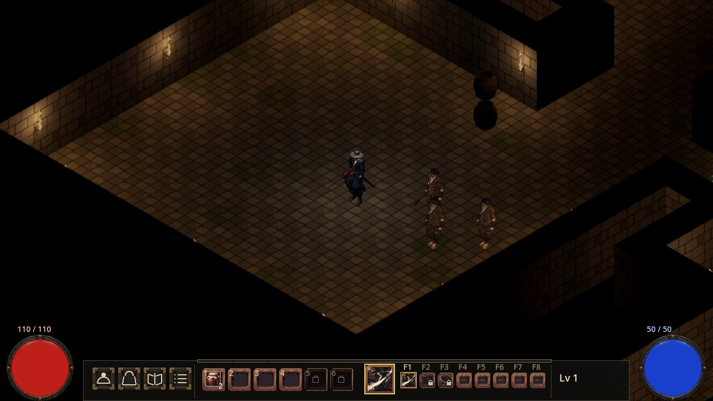
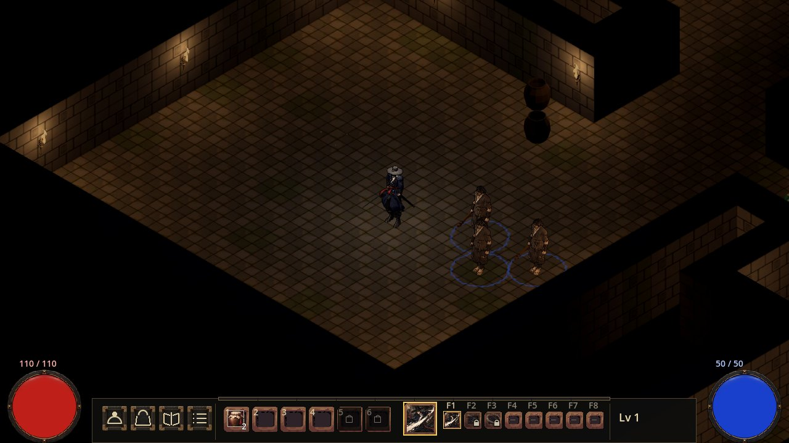
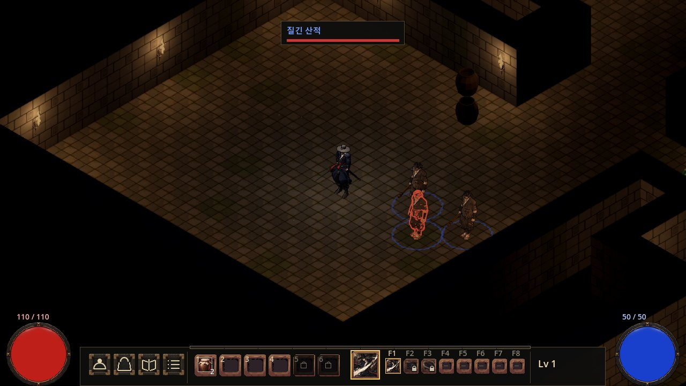
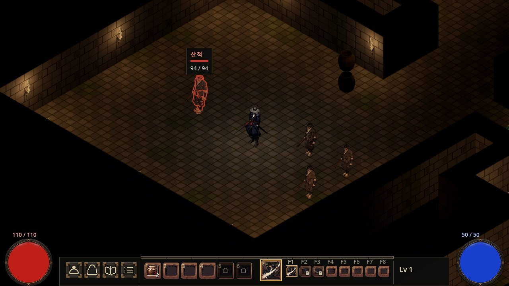
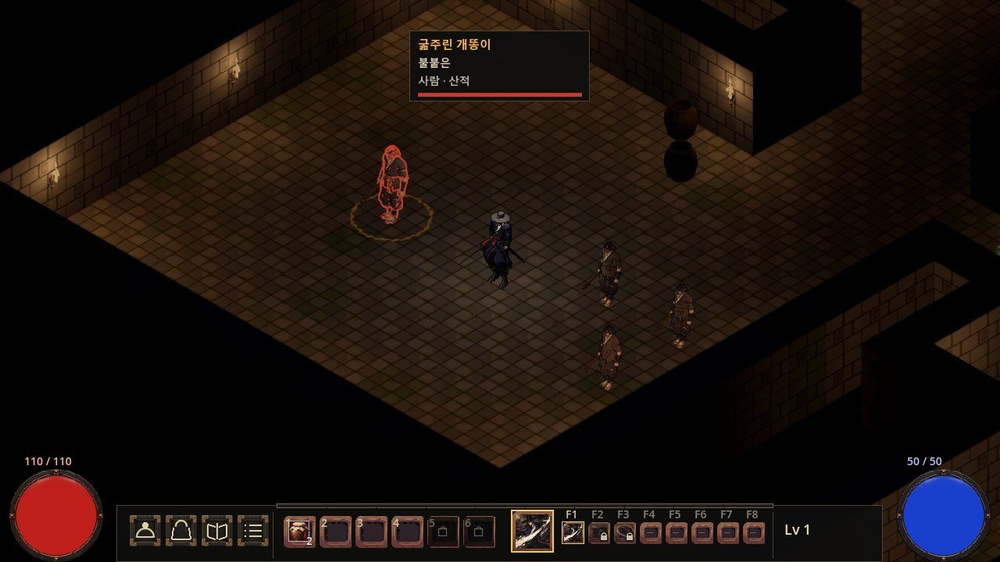
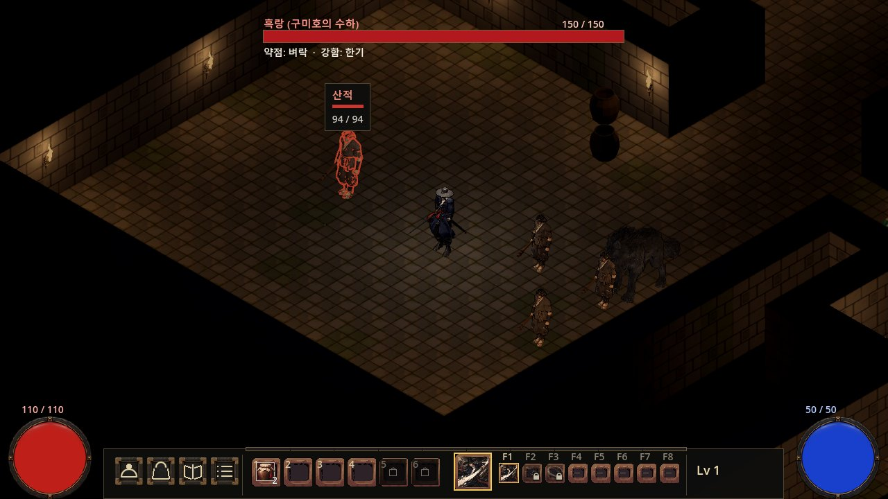
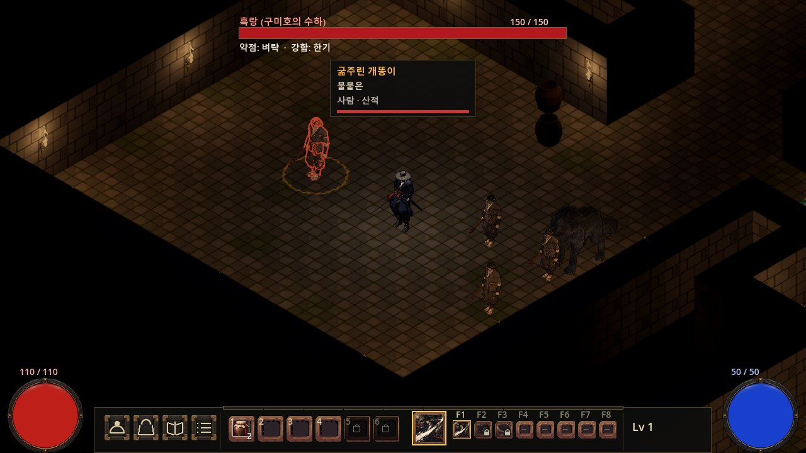
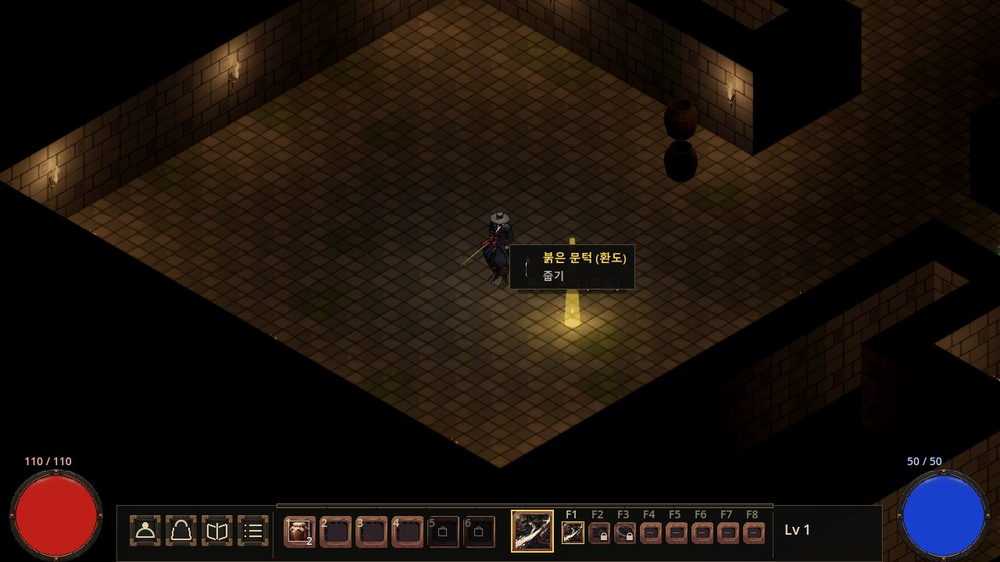
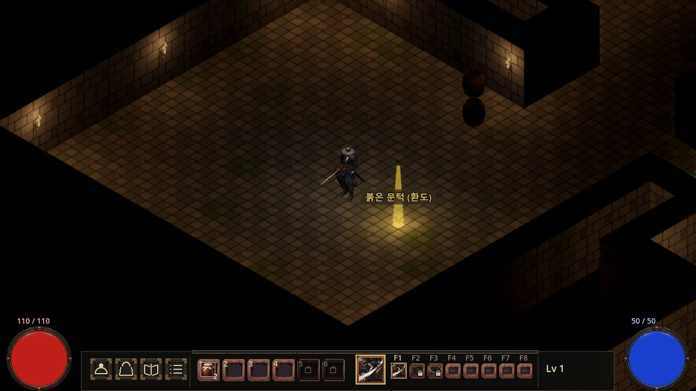

#293 정예 화면 검수 — 최신 HUD, 2026-09-26

현재 메인 `75a8b37d`를 수정 전으로 사용했다. `elite_ui_view`에서 시드 29320260926·같은 방·카메라·적/아이템 배치를 유지한 실제 1280×720 게임 화면이다. 후보는 메인 착륙 전 PD 검수용이다.

- `before_blue.jpg` / `after_blue_hover.jpg`: 같은 파란 무리 몸 호버 전후. 대상 위 숫자 상자를 화면 위 등급색 이름·체력 띠로 옮기고 발밑 쪽물 먹 원을 표시한다.
- `after_blue.jpg`: 호버 없는 파란 무리 셋의 먹 원.
- `after_gold_hover.jpg`: 우두머리만 금니 원. 하수인은 원이 없고, 위 띠는 굴린 이름·불붙은 옵션·사람/산적 부류와 체력 막대다.
- `after_gold.jpg`: 보스와 우두머리가 함께 있는 화면. 보스 바·약점 줄 아래 y=96에 다른 적의 호버 띠를 둔다.
- `after_floor_name_hover.jpg`: 바닥 희귀 이름표 자체의 글자·먹 판 강조. 이름표를 가리는 추가 줍기 상자는 없다.

단위 52종 및 도구 층 PASS. 창 모드 e2e 7/7, 합계 1602검사 PASS. 부팅 SCRIPT ERROR 0·오토로드 10/10·러너 자기검사 5/5 PASS.
등급 연속 변경 시 원 한 개 유지·숨김/복원·처치 직후 원 숨김도 실제 적에서 검사했다.

이 폴더는 폭 1280px·각 300KB 이하의 JPG 6장이다. 다섯 상태 전후 10장과 해시/검증 기록은 joseon-assets `reports/293/integration_2026-09-26/`에 둔다. 원본 PNG는 격리 user://e2e/의 elite_ui_view_01~05 화면이다.

코드 후보 커밋: `830b090d`. 게임 메인에는 아직 반입하지 않았다.

| 상태 | 수정 전 | 후보 |
|---|---|---|
| blue |  |  |
| blue_hover |  |  |
| gold_hover |  |  |
| boss_hover |  |  |
| floor_hover |  |  |
