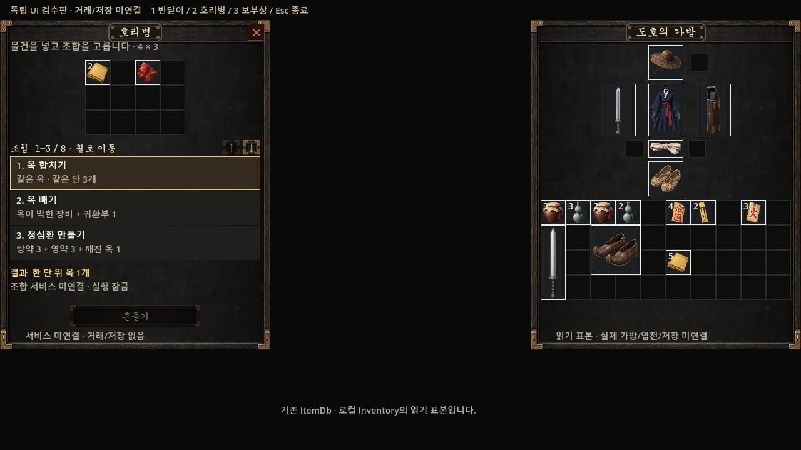

# #554 아이템 서비스 UI 검수판

2026-10-02. 신규 UI 결과3, actual Godot renderer. 1280/1920/2560 각3창 native 캡처9와 단위125 PASS. 실제 거래·저장·NPC 공개 연결은 #265/#266/#267 후속이며 이 검수 씬은 main에 연결하지 않았다. 오른쪽 가방은 실제 ItemDb·로컬 Inventory 읽기 표본이다. 검수용 문구가 실제 제품에 반입되는 것은 아니다. 현재 새 UI 최종 채택 전. 원본/실패 포함 로그=자산 reports/554/2026-10-02.

