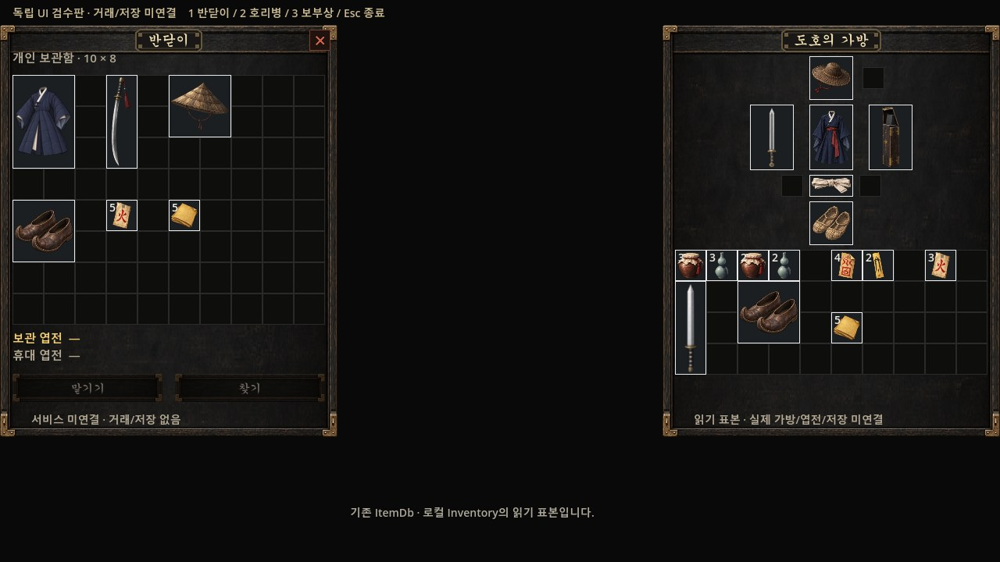
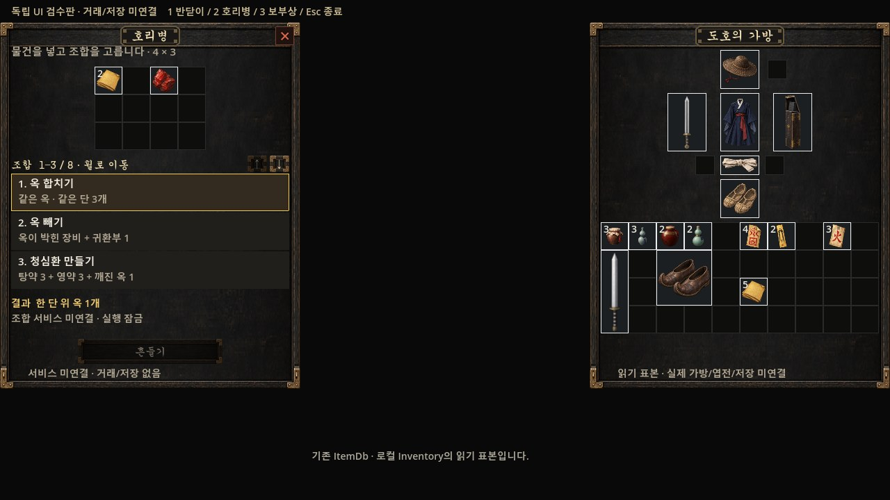
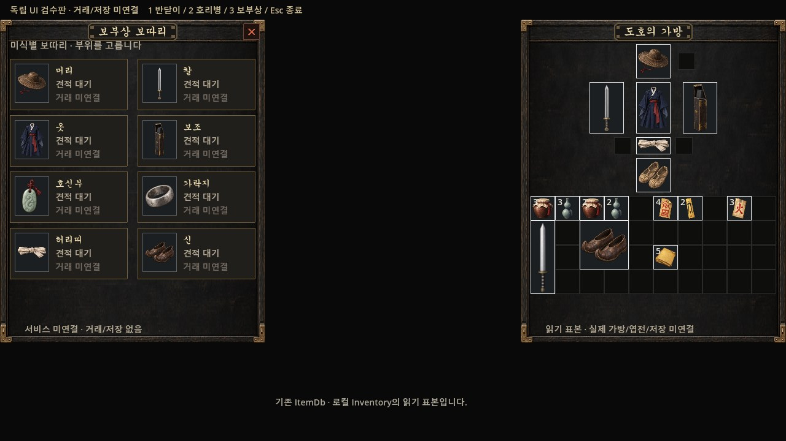
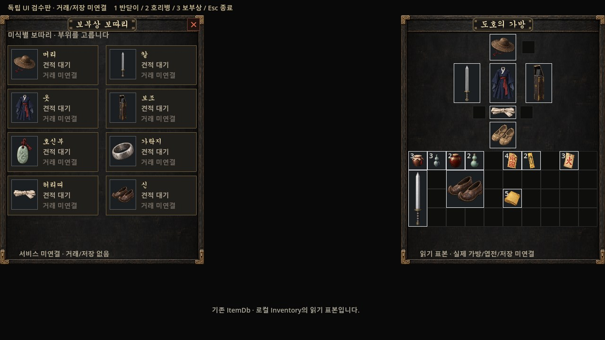

# #554 아이템 서비스 UI 검수판

2026-10-02 PD 명시 채택: ‘채택합치고 나머지 작업도 쭉 진행해’. 반닫이·호리병·보부상 UI와 독립 검수판을 채택했다. 실제 보관·조합·거래·저장·NPC 연결은 #265/#266/#267 이후 #273에서 진행한다. 현재 `runtime_connected=false`, 공식 main 착륙은 지휘 세션에 남아 있다.

같은 1280×720 구도에서 기존 후보와 최신 메인 정책 반영 결과를 비교한다. 채택한 창틀·배치·입력 영역은 그대로이고 오른쪽 가방은 #548의 물약 그림·표시 크기를 공용 `UiSkin.item_icon`으로 읽는다. #545 실제 메뉴를 포함한 main a92cf01e 위 capture commit 9952b7b9에서 단위125와 집중 E2E82/2종·러너5/5 PASS. 지휘 세션의 새 실렌더는 1280/1920/2560 각3창 native9이며 이전 native9·원문41·JPG3은 바이트 그대로 보존했다. JPEG 6장은 1280 폭·각300KB 이하이다.

원문과 native 원본: 기존 `joseon-assets/reports/554/2026-10-02/raw/final`, 새 원문 `C:/workspace/joseon/._tmp/reports_554/resumed_20261002`(자산 보존 목적지 `reports/554/2026-10-02/resumed_adoption`). 검수판 위·아래의 미연결 설명은 실제 거래 기능 완료를 뜻하지 않는다.

반닫이 — 변경 전

반닫이 — 최신 아이콘 반영 후

호리병 — 변경 전

호리병 — 최신 아이콘 반영 후

보부상 — 변경 전

보부상 — 최신 아이콘 반영 후

