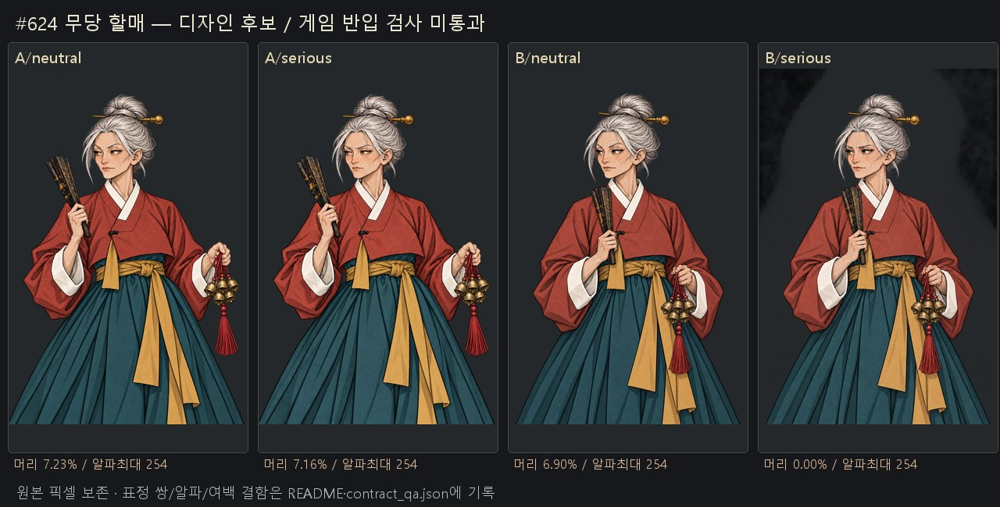
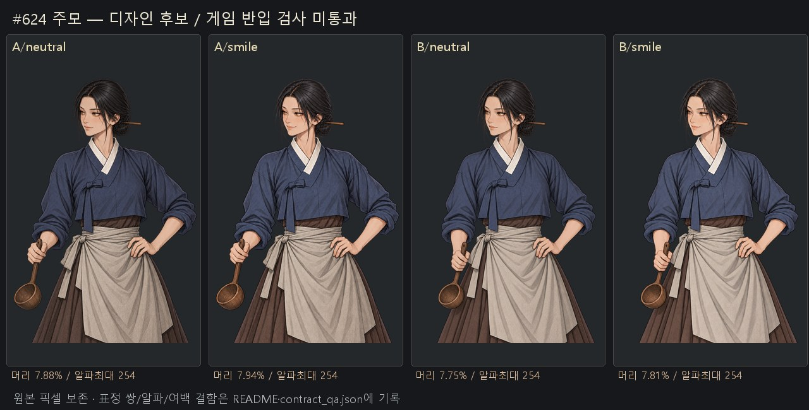
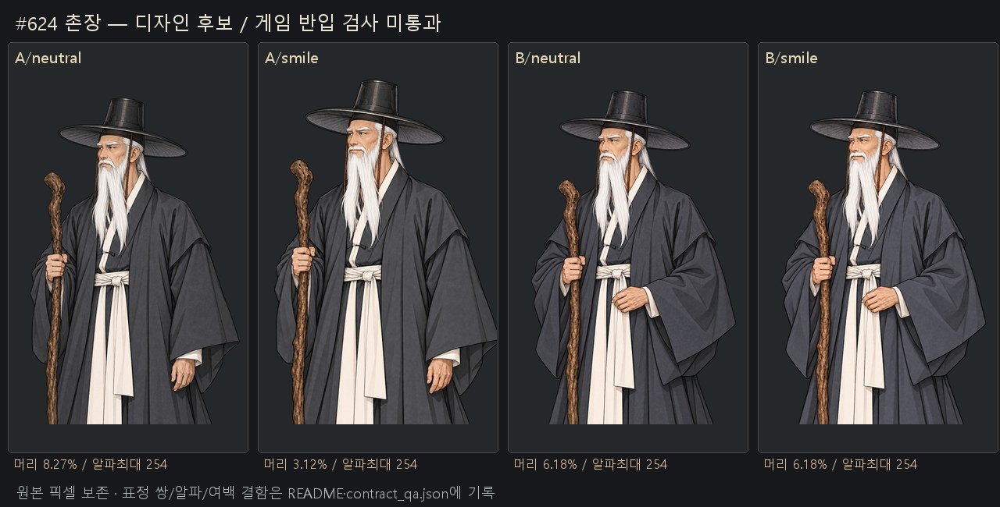
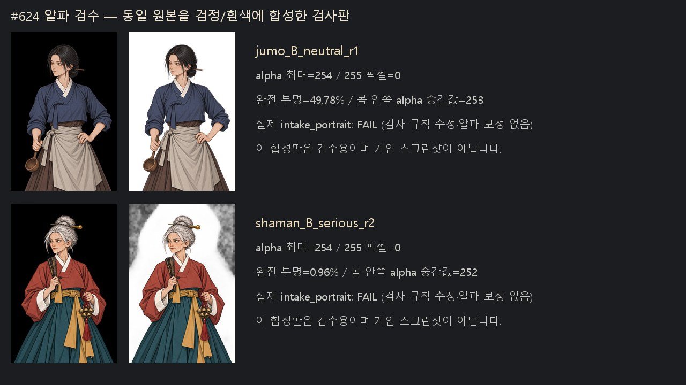
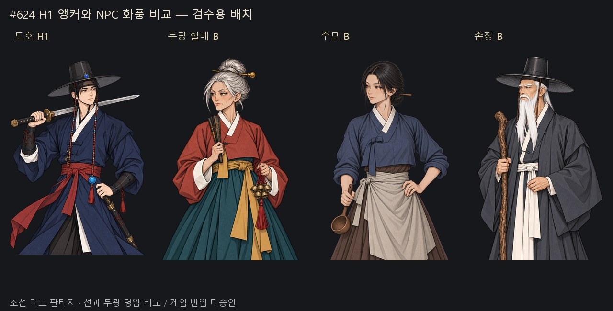

# #624 정지 초상 검수 후보 — 2026-10-04

생성은 Codex 내장 image_gen으로 수행하고 결과마다 대화에 표시했다. 후보 A/B 각각 neutral+표정1, 총12칸이며 교정 전/후 원본18장도 보존했다. 원본은 변형 없이 복사하고 SHA256을 확인했다. 표정 목록은 무당 neutral/serious, 주모·촌장 neutral/smile다.

**게임 반입 준비 완료로 판단하지 않는다.** 18장 모두 실제 tools/portrait_intake.py measure에서 불합격(완전 불투명255 없음)이다. 몸 안쪽 알파 중간값은 대부분253이며, 무당B serious r2는 배경까지 알파가 번진다. strict checker를 바꾸거나 Pillow로 원화 알파를 고치지 않았다.

## 검수판

## 원본 규격

| 디자인 칸 | 머리 위 여백(기준6.5~9.5%) | 좌우 여백 | 완전 투명 | 실제 반입 |
|---|---:|---|---:|---|
| shaman/A/neutral | 7.23% | FAIL | 43.33% | FAIL(alpha) |
| shaman/A/serious | 7.16% | FAIL | 43.20% | FAIL(alpha) |
| shaman/B/neutral | 6.90% | PASS | 47.97% | FAIL(alpha) |
| shaman/B/serious | 0.00% | FAIL | 0.96% | FAIL(alpha) |
| jumo/A/neutral | 7.88% | PASS | 48.12% | FAIL(alpha) |
| jumo/A/smile | 7.94% | PASS | 48.14% | FAIL(alpha) |
| jumo/B/neutral | 7.75% | PASS | 49.78% | FAIL(alpha) |
| jumo/B/smile | 7.81% | PASS | 49.92% | FAIL(alpha) |
| elder/A/neutral | 8.27% | PASS | 44.95% | FAIL(alpha) |
| elder/A/smile | 3.12% | FAIL | 37.27% | FAIL(alpha) |
| elder/B/neutral | 6.18% | PASS | 45.08% | FAIL(alpha) |
| elder/B/smile | 6.18% | PASS | 44.98% | FAIL(alpha) |

## 표정 쌍 정렬

| 세트 | alpha>16 IoU(기준≥0.97) | 머리 이동(기준≤6px) | 정렬 |
|---|---:|---:|---|
| shaman_A | 0.994370 | 1px | PASS |
| shaman_B | 0.792843 | 106px | FAIL |
| jumo_A | 0.991581 | 1px | PASS |
| jumo_B | 0.990373 | 1px | PASS |
| elder_A | 0.836399 | 79px | FAIL |
| elder_B | 0.996972 | 0px | PASS |

무당A는 옷 아래 왼쪽 테두리가 닿는다. 무당B serious r2는 그림상 같은 구도지만 배경 알파 오염으로 정렬도 불합격이다. 배경 제거 재시도r3는 다시 확대돼 archive에 보존했다. 촌장A smile도 확대돼 정렬이 실패하며, 촌장B는 두 표정 정렬은 맞지만 머리 여백6.18%로 기준 미달이다. 주모A/B는 머리·좌우 여백과 표정 쌍 정렬을 통과하나 알파255 기준은 통과하지 못했다.

## 선택과 후속

디자인 검토 추천은 주모A/B 비교, 무당B의 압축된 소품 자세, 촌장B의 허리 손 자세다. 최종 게임용 채택은 기술 규격 보완 후 실제 대화 화면 검수를 거쳐야 한다. #617 한 벌 통일·#616 표정 태그보다 앞서 이 카드에서 알파/프레임 교정을 마쳐야 하며 현재 PD 최종 채택·게임 반입은 수행하지 않았다.

구조는 neutral을 기준으로 얼굴만 편집하는 방식이다. 처음부터 표정별 독립 생성은 얼굴/소품/몸 크기가 달라질 위험 때문에 기각했다. 이번에도 일부 얼굴 편집이 확대됐으므로 지시만 믿지 않고 실제 마스크·머리 이동으로 판정했다.

generation.json은 전체 프롬프트·참조·native 저장 경로·노출되지 않은 모델 버전 null을 기록한다. contract_qa.json은 실제 검사 결과다. contract_qa_readonly.py는 원본 측정용이며 픽셀을 수정하지 않는다. manifest.json은18원본과5검수JPG의 크기·해시를 기록한다. 원본 합36.4MB로50MB 미만·개별10MB 미만이어서 git 보관 기준을 충족한다.
