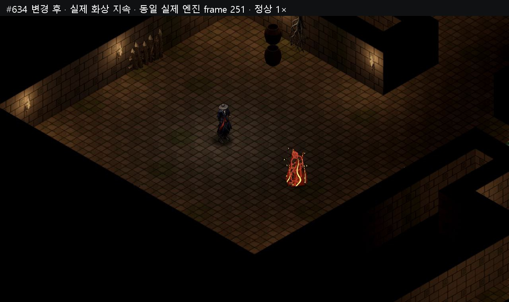
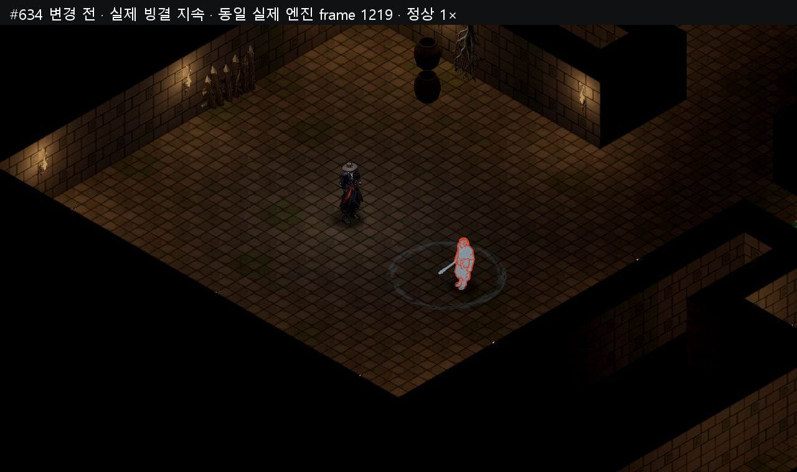
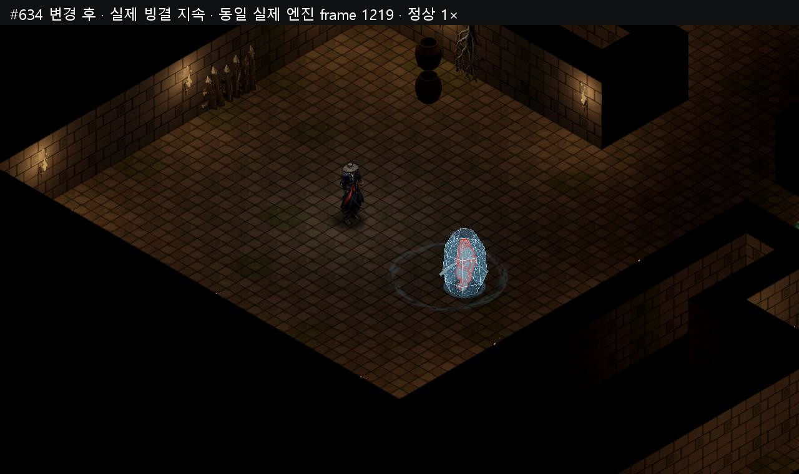
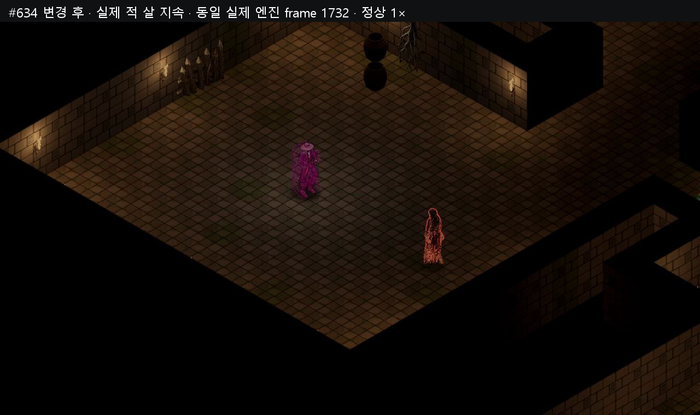

# #634 몸 상태 구조 v1 — 실제 전후 영상

화상·한기·빙결·살을 실제 입력과 전투로 녹화했다. 불/한기 부적 belt 입력, 냉기 어픽스 무기 실제 1타, 나찰녀의 실제 살 구슬과 살풀이 부적을 사용했다. 4구간 각360프레임(6초), 합24초이며 정상1×다. Godot MovieMaker 기록60fps는 실시간 성능 수치가 아니다. 개발키/direct status 호출로 상태를 만들거나 지속시간을 늘리지 않았다.

기준 runtime/data146개는 최종 #632 `d66e6e8abde89e0cceb001bb036d62966e534cfc` commit blob과 raw-byte SHA256이 전부 같다. 기준 촬영 당시 HEAD `8914e7c0633dfb45b8450f9c3218081cf46cc51a`도 원본 메타에 보존했다. 변경 후 최종 촬영은 AFTER02이며 새 `core/vfx_status.gd`를 포함한147개 raw source SHA256을 기록했다. 촬영 대본 SHA256 `5ae9b40f12e7d9a5f34542a280b5160f94d8f359768dd0cc95801ad2dc10d41e`는 전후 동일하다. 전후 각각 **37/37 PASS**다.

피해·HP/MP·무기 어픽스·belt 소모·타격·DOT tick·고정 시드 전투 RNG·배우/목표/카메라·모든 상태 timer/carry의 binary64·클립/애니 위치·빙결 speed0·전투 입력·프레임/물리 시계·time_scale을 exact 대조했다. 세이브는 Main 생성 전에 `video634_capture.json`을 선택했으며 `reset_game`을 호출하지 않고 active profile이 비어 있음을 검증했다.

화상은 실제25피해+4틱15피해 뒤 자연 종료, 냉기 무기는 실제8피해 1타 후 자연 종료, 빙결 부적은 실제12피해와 기존1.5초 frozen·애니 정지 후 종료다. 냉기 무기의 짧은 실제 한기를 영상용으로 늘리지 않았다. 살은 실제4피해+4틱5피해, 살풀이 입력 frame240 뒤 첫 mask32 snapshot242에서 해제되고 기존30초 살풀이 버프가 유지된다.

| 영상 | 길이 / 프레임 | 크기 |
|---|---:|---:|
| [634_status_structure_before_after_60fps.mp4](C:/workspace/joseon-assets/reports/634_status_structure_v1/634_status_structure_before_after_60fps.mp4) | 24.000000초 / 1440 | 3,334,534B |
| [634_status_structure_actual_60fps.mp4](C:/workspace/joseon-assets/reports/634_status_structure_v1/634_status_structure_actual_60fps.mp4) | 24.000000초 / 1440 | 4,193,578B |
| [634_status_structure_before_engine_capture_60fps.mp4](C:/workspace/joseon-assets/reports/634_status_structure_v1/634_status_structure_before_engine_capture_60fps.mp4) | 33.116667초 / 1987 | 4,326,438B |
| [634_status_structure_after_engine_capture_60fps.mp4](C:/workspace/joseon-assets/reports/634_status_structure_v1/634_status_structure_after_engine_capture_60fps.mp4) | 33.116667초 / 1987 | 4,391,385B |

비교 영상은 같은 (280,80,720,540) crop을 좌우640×480으로 보여준다. 실제 영상과 전체 엔진 전후 영상은 원래 카메라1280×720 화면이다. 4편 모두 whole decode 오류0·60/1fps·프레임 수·파일당10MB 검사를 통과했다. edit은1440frames/24초, fullengine은1987frames/33.116667초다. 정확한 경계 `[BEGIN,END)` 및 48kHz stereo 원음800samples/frame을 사용한다.

기존 Audio의 독립 변주/pitch RNG 때문에 촬영 전후 원음은 byte동일하지 않다. 비교/actual edit은 같은 AFTER 실제 원음을 공유하고 fullengine 전후는 각 원음을 그대로 남겼다. PCM segment SHA와 차이 사유를 manifest에 기록했다.

같은 프레임 사진은 원소 명중 burst가 끝난 뒤 지속 상태를 보여준다. 현재 안개·알파·카메라와 기존 tint/blink를 그대로 사용했다. 각1280폭·300KB 이하이며 총6장이다.

| 실제 지속 상태 | 변경 전 | 변경 후 |
|---|---|---|
| 화상 · 동일 engine frame251 |  |  |
| 빙결 · 동일 engine frame1219 |  |  |
| 살 · 동일 engine frame1732 |  |  |

원본·영상·메타·촬영/편집/검증 대본·실패와 성공 raw 전문은 [assets 보고서](C:/workspace/joseon-assets/reports/634_status_structure_v1/README.md)에 보존한다. 큰 AVI는 로컬 ignored 경로·바이트·SHA256을 별도 기록하며 fullengine MP4를 공유본으로 남긴다. 반복 프레임 메타가 들어간 capture raw/engine 원문은 byte를 바꾸지 않고 ZIP 보존한다. 각 항목/ZIP entry SHA와 전체 archive manifest를 대조한다.

최초 baseline의 fixture 오류 및 AFTER01 런처 --new 누락으로 town에서 종료한 오류를 보존했다. 유효 BEFORE/AFTER02는 실행 중 shader/runtime error0이며 기존 녹화 종료 후 ObjectDB11/resource6 메시지도 원문 그대로 보존·분류했다.

최종 전체 test.ps1 종료0: 단위101·설정 재시작2·도구23·러너5/5·E2E143/143 PASS(단독10/10·공유133/133). 신규 실제 창36검사·모듈276검사 PASS. 최종 게임 커밋과 source147 원본 바이트 대조는 assets archive manifest에 기록한다.

Archive game commit: `507ce464`. Capture logs with repetitive full per-frame arrays are losslessly preserved in `logs/capture_raw_originals.zip`; `logs/capture_raw_zip_manifest.json` records every uncompressed byte count and SHA. Every E2E phase referenced by copied logs includes original godot.raw.log and phase.json. Intermediate AVIs remain local with exact byte/SHA registry.
