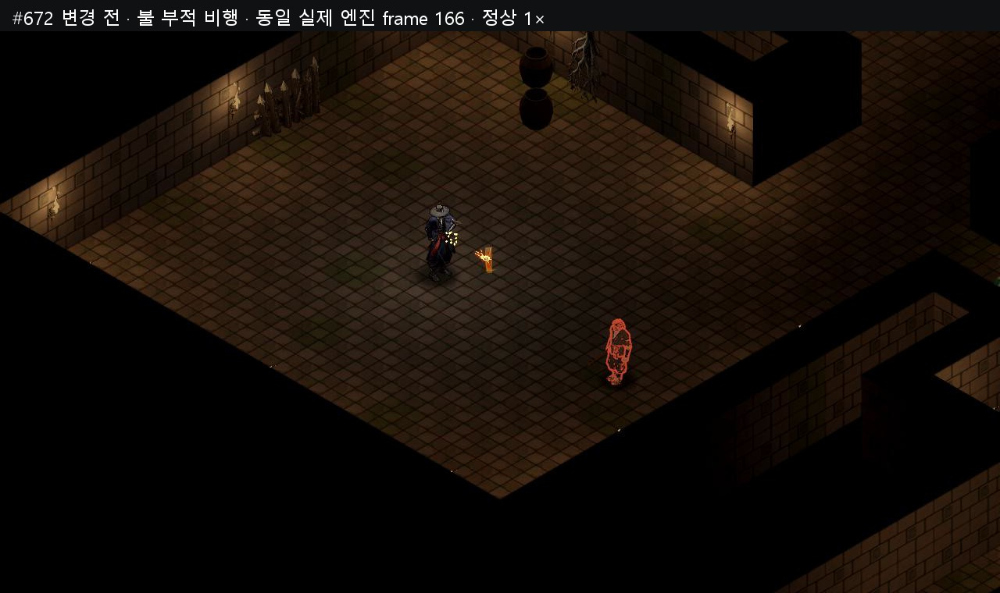
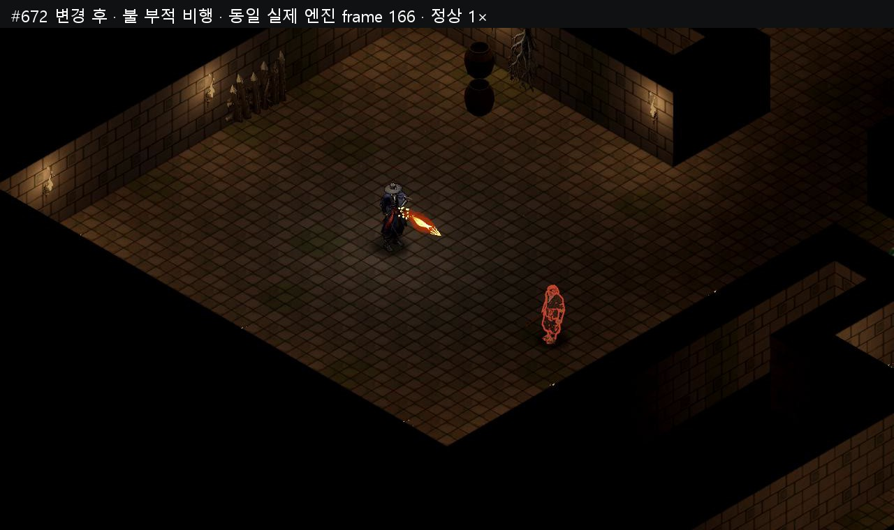
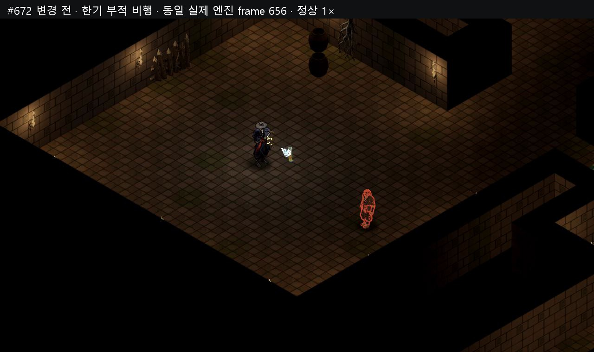
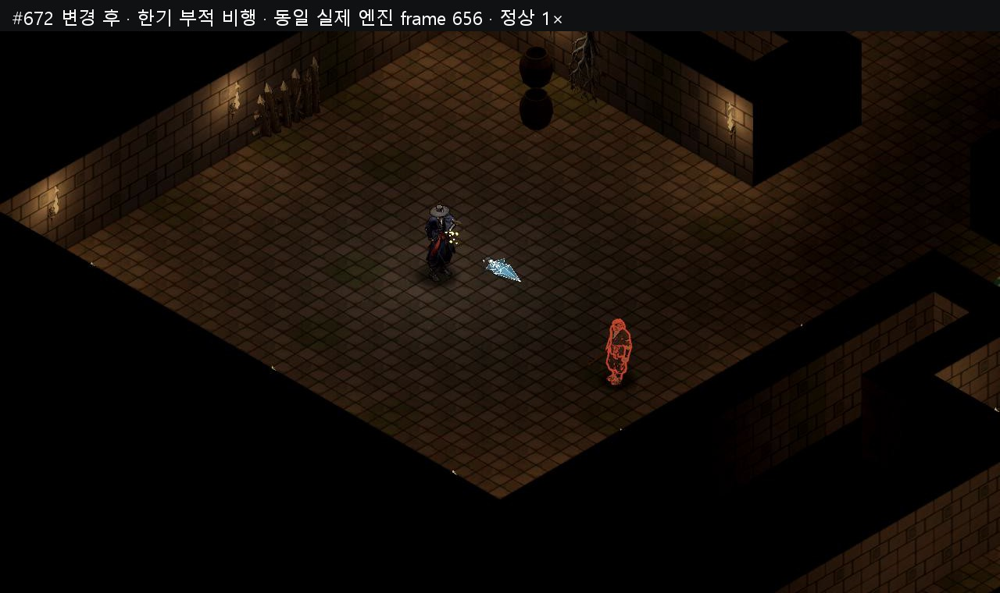
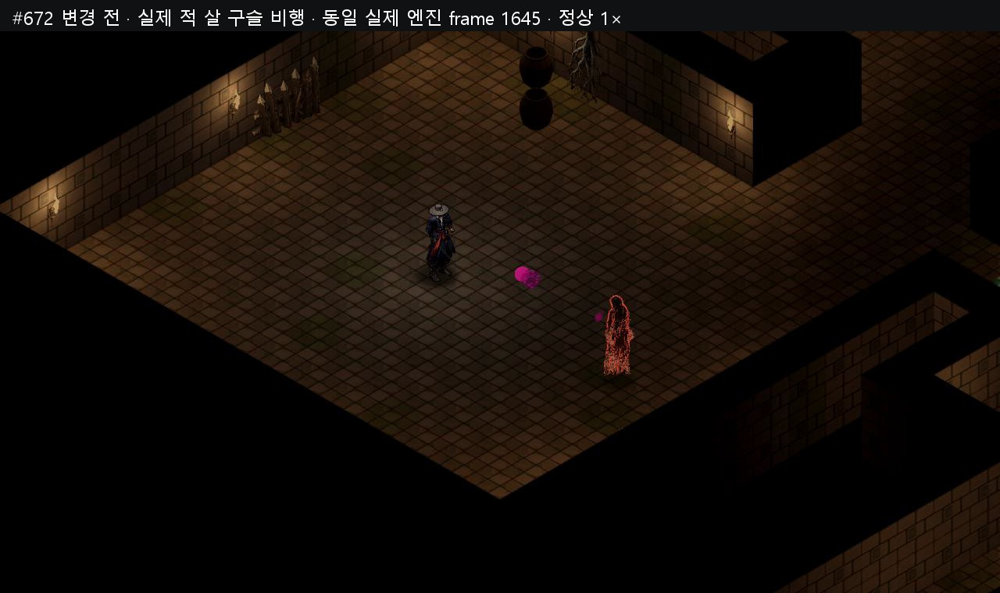

# #672 원소 비행 v1 — 실제 전후 영상

불·한기·벼락 부적을 실제 belt 입력으로 던지고 나찰녀가 실제 살 구슬을 발사했다. 각 360프레임(6초), 네 구간 합 24초다. 정상 1× Godot MovieMaker 60fps 기록이며 실시간 성능 수치가 아니다. 발사부터 비행·명중·기존 #634 상태의 지속과 자연 종료까지 원래 게임 카메라로 기록했다.

5u의 같은 정지 표적을 사용한다. 불/한기는 기존 1.5 반경 AOE이며 이 무대에서는 실제 표적 1개만 맞는다. 벼락은 기존 단일 명중이며 체인을 추가하지 않았다. 살은 플레이어 주문이 아닌 실제 적 투사체다. 첫 적 구슬 뒤 재발사만 막고 홀림/스침 hook의 clock을 촬영 각 프레임에 고정하여 첫 투사체의 움직임을 격리했다. 적 AI는 sal 입력 frame30에서 풀고 이후 실제 physics·구슬·상태 틱은 그대로 진행한다.

변경 전 플레이어 부적 속도는 10u/s, 적 살 구슬은 8u/s다. 변경 후 불은 6→18u/s로 0.25초 동안 가속하고 한기는 14u/s, 벼락은 60u/s, 살은 4.4u/s다. 최초 관측 불 속도는 6.0000004768u/s이며 다음 native 물리 스텝에서는 약6.8u/s로 증가한다. 속성별 탄두와 후류는 게임의 메시/먹 붓결/셰이더이며 영상 필터로 추가하지 않았다. 비행·타격의 절대 프레임과 좌표가 달라지는 것은 이번 변경 내용이다.

탄두를 후류와 분리한 구조를 사용했다. 빠른 벼락과 느린 살이 각각의 속도로 움직이면서도 후류/루프 수 제한에 의해 탄 자체가 사라지지 않게 하기 위해서다. 후류만 강화하는 방식은 예산 제한 시 실체가 사라지므로, 독립 1-pass 탄두와 제한된 후류를 함께 사용한다. 빠른 탄의 실제 충돌은 native sweep으로 확인한다.

기준 runtime/data 147개는 최종 #634 `507ce46480ae5d0b1c9a20664d844173a65b7413` commit blob과 raw-byte SHA256이 모두 같다. 기준 촬영 당시 HEAD `d66e6e8abde89e0cceb001bb036d62966e534cfc`는 원본 메타에 남겼다. 변경 후 AFTER01은 새 비행 utility와 기존 status 모듈을 포함한 148개 raw source SHA256을 기록했다. 고정 촬영 대본 SHA256 `5ef2977764f17386c37b4ea36b77f5ca1b283e82028de0c59f85517526dbe92e`는 전후 동일하며 각각 **47/47 PASS**다.

같은 발사 프레임·입력·장비·정기150·캐릭터/지역레벨·목표·피해/명중 순서·전체 DOT 틱 수와 정수 피해·최종 전투/투사체 RNG·HP/MP·belt 소모·부적 배율2.5·범위·상태 초기 duration을 대조했다. 시간/물리 프레임과 배우/목표 위치는 모든 구간 360개 샘플에서 exact 같다. SaveSystem은 Main 생성 전에 독립 `video672_capture.json`을 선택하며 active profile은 비어 있다. 공유 reset_game/save_e2e를 호출하지 않았다.

명중 프레임은 불 89→83, 한기 89→81, 벼락 89→68, 살 94→117이다. 불은 직접25+DOT4틱15, 한기12, 벼락42, 살은 직접4+DOT6틱9로 전후 같다. 카메라의 기준 위치·회전·직교 크기11과 변경 없는 camera source를 확인했다. 실제 명중 흔들림을 유지했으며 명중 후30개 샘플의 파형은 exact 같고 절대 재생 시점만 명중에 따라 이동한다.

불/한기의 native 초기 상태는 exact 같다. BEFORE Area3D 충돌이 적 status.advance 전에 들어간 반면 AFTER swept hit는 그 틱 advance 뒤에 들어간다. AFTER 첫 스냅샷이 초기 상태 그대로인 1개 미진행 샘플임을 event/physics counter/GameClock/모든 binary64로 증명했다. 이 관측된 샘플 뒤부터 자연 종료까지 상태·timer·carry 전체가 exact 같다(불120, 한기134, 살180개 샘플). 불의 명중 기준 DOT 콜백 프레임은 [28,58,88,118]→[29,59,89,119]이며 틱 피해·duration·advance 수는 같다. 살은 보정 없이 hit-relative 전체 상태가 exact 같다. 단순 프레임 tolerance로 차이를 숨기지 않았으며 전체 원문과 비교 근거를 manifest에 보존했다.

| 영상 | 길이 / 프레임 | 크기 |
|---|---:|---:|
| [672_element_flight_before_after_60fps.mp4](C:/workspace/joseon-assets/reports/672_element_flight_v1/672_element_flight_before_after_60fps.mp4) | 24.000000초 / 1440 | 3,311,572B |
| [672_element_flight_actual_60fps.mp4](C:/workspace/joseon-assets/reports/672_element_flight_v1/672_element_flight_actual_60fps.mp4) | 24.000000초 / 1440 | 4,140,701B |
| [672_element_flight_before_engine_capture_60fps.mp4](C:/workspace/joseon-assets/reports/672_element_flight_v1/672_element_flight_before_engine_capture_60fps.mp4) | 33.116667초 / 1987 | 4,360,836B |
| [672_element_flight_after_engine_capture_60fps.mp4](C:/workspace/joseon-assets/reports/672_element_flight_v1/672_element_flight_after_engine_capture_60fps.mp4) | 33.116667초 / 1987 | 4,385,396B |

전후 비교는 같은 (280,80,720,540) crop을 좌우640×480으로 보여준다. 실제 AFTER와 전체 엔진 전후는 원래1280×720 카메라다. 4편 모두 전체 decode 오류0·60/1fps·프레임 수·파일당10MB 미만 검사를 통과했다. 편집본1440프레임/24초, fullengine1987프레임/33.116667초다. AVI zero-based N은 Engine process counter N이며 정확한 [BEGIN,END) 경계와 원음800samples/frame을 사용한다.

비교 영상의 화면에는 **AFTER AUDIO**를 명시했다. 전후 명중 시점이 달라 비교 음성은 AFTER 쪽에만 귀속된다. 실제 AFTER 편집본과 전체 BEFORE/AFTER는 각자의 native 원음을 정확히 동기화한다. 기존 독립 Audio RNG의 변주/pitch도 전후 다르므로 원음 byte 동일 주장은 하지 않는다. PCM 구간 SHA와 명중 시점 차이를 기록했다.

같은 엔진 프레임 사진은 두 탄이 실제 비행 중인 불/한기/살 3쌍이다. 벼락의 빠른 비행은 전체 영상과 4속성 컨택시트에 담았다. 현재 안개·알파·색·카메라를 유지했다. 각1280폭·300KB 이하, 총6장이다.

| 실제 비행 | 변경 전 | 변경 후 |
|---|---|---|
| 불 · 동일 engine frame166 |  |  |
| 한기 · 동일 engine frame656 |  |  |
| 적 살 구슬 · 동일 engine frame1645 |  |  |

원본·영상·메타·촬영/편집/검증 대본·실패와 성공 raw 전문은 [assets 보고서](C:/workspace/joseon-assets/reports/672_element_flight_v1/README.md)에 보존한다. 반복 배열을 가진 raw/engine 로그는 원문 byte 그대로 ZIP 보존하며 각 entry의 byte/SHA를 기록한다. 대용량 AVI는 로컬 ignored 경로·크기·SHA를 기록하고 fullengine MP4를 공유본으로 남긴다.

최초 BEFORE fixture 실패(바닥 y 비교·홀림 hook), 첫 camera absolute 비교 실패를 보존했다. 유효 BEFORE/AFTER01은 실행 중 shader/runtime error0이며 녹화 종료 후 기존 ObjectDB11/resource6 메시지가 전후 동일하게 나타난 원문도 분리 보존했다.

최종 검증은 단위102·설정 재시작2·도구23·runner5/5 PASS다. 첫 전체 E2E는 **143/144**(단독10/10, 공유133/134)이며 종료코드1이었다. 유일 실패는 `talisman_throw` 검사가 이미 free된 shot의 ended를 읽던 관측 fixture 2항목이다. 실제 막타·속성·드랍·줍기는 이 실행에서도 통과했다. 관측을 자연 `enemy_died` 콜백에서 free 전 종료 snapshot을 기록하도록 TEST ONLY 보완했으며 촬영 runtime148개 raw SHA는 변하지 않았다.

보완 뒤 focused 재검수는 **3/3 PASS**, 종료코드0이다(`talisman_throw`56검사·`element_flight_v1`45·`status_structure_v1`36, 42초). 첫 전체143종과 보완 후 재검수로 최종144종을 covered로 집계하며 단일 전체144/144 PASS로 기록하지 않는다. 실제 전후 영상 캡처는 각각47/47 PASS다.

[첫 전체 시험 원문](C:/workspace/joseon-assets/reports/672_element_flight_v1/logs/672_element_flight_v1/full_test_01.raw.log)과 [보완 후 재검수 원문](C:/workspace/joseon-assets/reports/672_element_flight_v1/logs/672_element_flight_v1/final_focus_01.raw.log), 각 로그의 실제 solo/shared godot.raw.log 및 phase.json 전문을 보고서에 함께 보존한다. 최종 게임 커밋 provenance와 촬영 source148개 Git blob 대조는 커밋 후 assets 보고서 manifest에 기록한다.

Archive game commit: `8d8cb26ba10a31f2922f55862216037d1b86b382`. Capture logs with repetitive full per-frame arrays are losslessly preserved in `logs/capture_raw_originals.zip`; `logs/capture_raw_zip_manifest.json` records every uncompressed byte count and SHA. Every E2E phase referenced by copied logs includes original godot.raw.log and phase.json. Intermediate AVIs remain local with exact byte/SHA registry.
