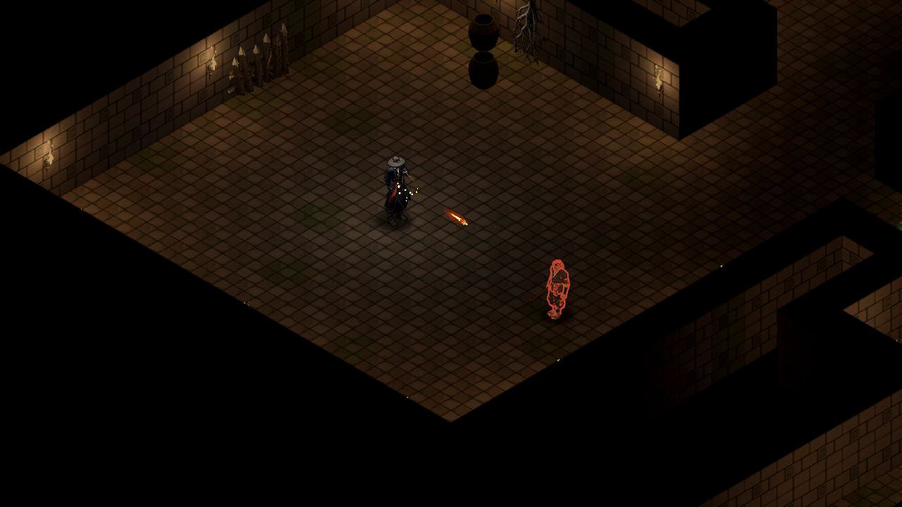
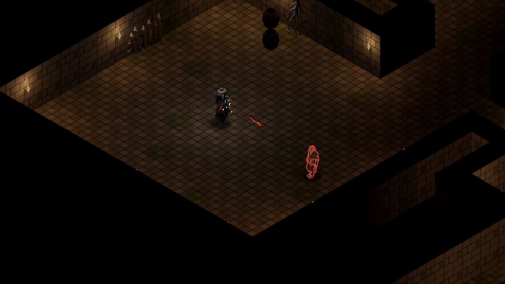
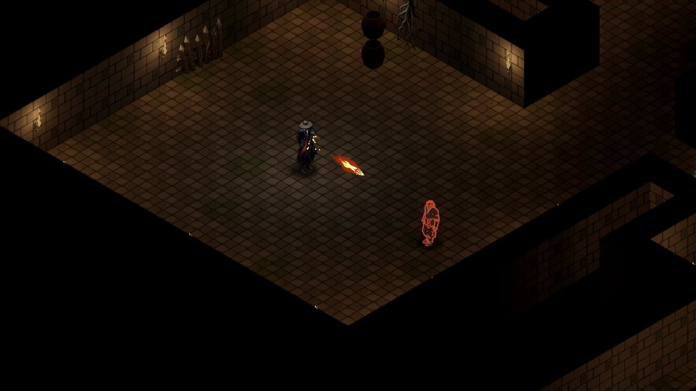
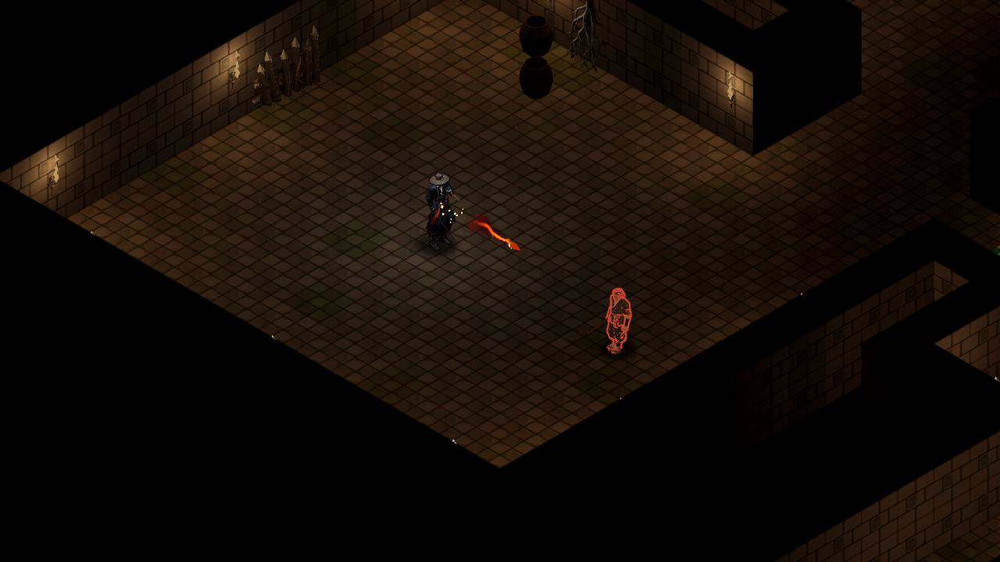
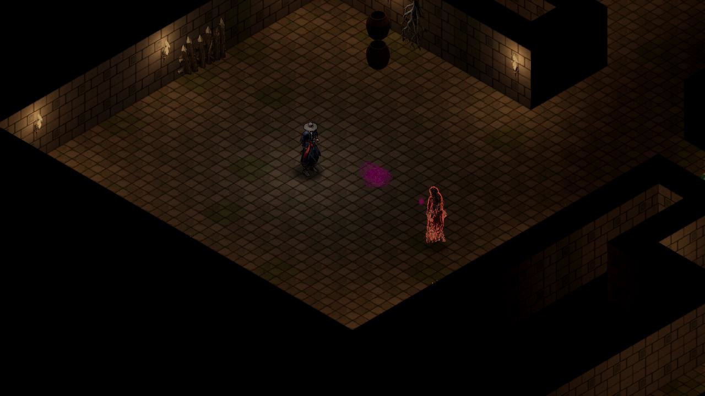
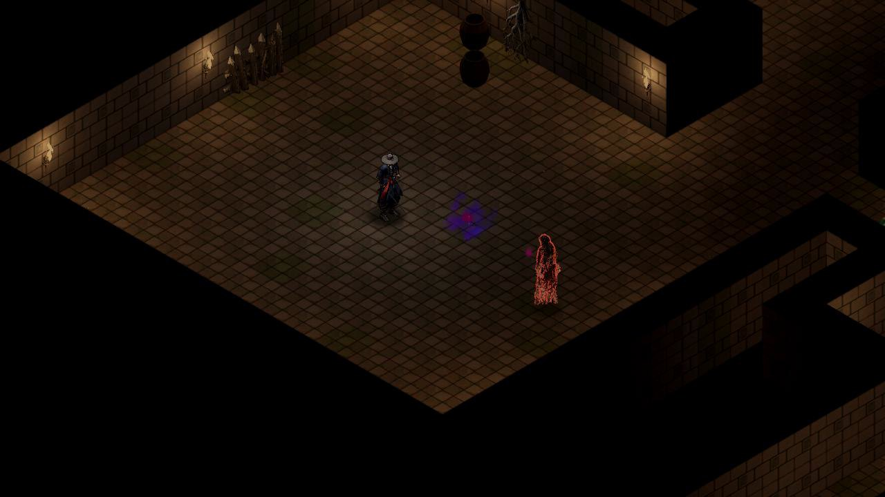

# #680 Blender + Godot VFX 실제 전후

시험플래그 Vfx.blender_test_enabled는 기본false이며 촬영·E2e에서 명시적으로 true를 켜는 프로토타입이다. PD채택 전 기본게임에 자동 적용하지 않는다.

실제 화염부(KEY2 벨트 입력)와 나찰녀 살 구슬(native 적 AI)을 약/강 각각 6초씩 기록했다. 정상1× Godot MovieMaker60fps이며 실시간 성능 수치가 아니다. 약/강은 플레이어 정기20/150, 적 지역레벨1/16으로 기존 실제 grade0/2를 선택한다. 5u의 동일 무대·입력·배우·카메라를 썼으며 피해/MP/벨트·발사/명중프레임·속도·모든 DOT/상태 binary64·애니·전투/구슬 RNG·카메라 흔들림 전후 전체 기록이 exact 같다.

BEFORE와 AFTER 각각 48/48, 48/48 PASS. 불은 발사64→명중83, 살은 발사63→명중117(구간 상대프레임)이며 전후 동일하다. 약불 직접12+DOT7, 강불25+DOT15, 약살1+DOT3, 강살4+DOT9이다. 약살의 zero 정수 피해 틱은 실제 native 콜백에서 생략되어 양수 DOT 콜백3, 강살6이며 전체 상태시계를 그대로 비교했다.

첫 살 구슬 뒤 재발사만 막고 pull/graze hook의 clock을 프레임마다 고정해 한 발의 실제 AI/물리/피격/상태 자연 종료를 격리했다. 새 공격·강제 피해·수동 명중·상태변조는 없다. Main 생성 전 private video680_capture.json을 선택하고 active profile은 비워 기존 저장과 분리했다.

비교는 같은 actual 프레임 (510,210,320,240)을 좌우 640×480으로 2× 확대한 영상이며 확대보기를 화면에 표시했다. 실제 AFTER 편집본과 fullengine BEFORE/AFTER는 원래1280×720 카메라/원음이다. 프레임 추가/감속 없이 [BEGIN,END)360프레임씩 자르고 frame당48000Hz PCM800sample을 맞췄다. 독립 Audio RNG의 variant/pitch 변주는 원음 그대로 보존하며 A/B는 AFTER AUDIO를 명시한다.

촬영 전후 runtime/data/시트/메타/GLB의 raw SHA를 video_manifest에 보존했다. 기준861/881 파일은 bc7b48c5 Git blob과 raw byte exact이며20개의 기존 VFX meta.json만 checkout CRLF이고 LF-normalized bytes는 exact이다(게임 .gd/.gdshader에는 차이0). 원문 byte와 각 예외 SHA를 함께 기록한다. 최종 AFTER 커밋 대조는 root가 확정 후 manifest에 기록한다.

AFTER03과 같은 시각의 최종 AFTER04를 다시 실제 촬영했다. 신규 Blender meta.json2개의 CRLF를 최종 Git blob과 같은 LF로 정리했으며 JSON 값·PNG·GLB·runtime GD는 동일하다. 신규 자료에는 정규화 예외를 추가하지 않는다. 구판 source/runtime 원본과 전체 촬영 기록을 보존하고 최종 LF 원본의 실제 영상·사진·전투 대조를 다시 검증했다.

| 영상 | 길이 / 프레임 | 크기 |
|---|---:|---:|
| [680_blender_vfx_before_after_60fps.mp4](C:/workspace/joseon-assets/reports/680_blender_vfx_test/680_blender_vfx_before_after_60fps.mp4) | 24.000000초 / 1440 | 4,756,977B |
| [680_blender_vfx_actual_60fps.mp4](C:/workspace/joseon-assets/reports/680_blender_vfx_test/680_blender_vfx_actual_60fps.mp4) | 24.000000초 / 1440 | 3,560,280B |
| [680_blender_vfx_before_engine_capture_60fps.mp4](C:/workspace/joseon-assets/reports/680_blender_vfx_test/680_blender_vfx_before_engine_capture_60fps.mp4) | 33.116667초 / 1987 | 4,396,718B |
| [680_blender_vfx_after_engine_capture_60fps.mp4](C:/workspace/joseon-assets/reports/680_blender_vfx_test/680_blender_vfx_after_engine_capture_60fps.mp4) | 33.116667초 / 1987 | 4,393,362B |

| 실제 비행 동일프레임 | 변경 전 | 변경 후 |
|---|---|---|
| 약 화염부 · engine170 |  |  |
| 강 화염부 · engine660 |  |  |
| 강 살 구슬 · engine1656 |  |  |

첫 setup 실패2회(타입추론/오프닝 우회누락)와 유효 before/after 및 encoder/decode 원문은 capture_raw_originals.zip에 byte 그대로 보존했다. 첫 sandbox 실행의 shadercache 권한 오류도 실패 원문에 남긴다. 유효 BEFORE의 종료 후 기존 ObjectDB11/resource6 메시지는 runtime 오류와 구분하여 원문을 보존했다. AFTER01은48/48과 전체전투 exact를 통과했지만 실제 시각이 너무 약해 기각했다. 큰 투명여백과 낮은 shaderalpha를 공통alpha crop/reanchor·표시크기·gain으로 보완했다. AFTER02도48/48과 exact를 통과했지만 강불이 긴 노란 전선/번개처럼 보여 다시 기각했다. 최종 화염은 따뜻한 주홍 density ramp·낮은 밀도 alpha gamma·탄두 쪽 좁은 core taper로 보완했다. 기각된 actual fullengine(A01)/실제 강불6초AB(A02)·전체 원문/metadata·변경runtime 원본은 rejected_after01/02_manifest와 capture_runtime에 보존한다. 모든 공유MP4 full decode0, 파일당10MB미만이다. 대형AVI는 ignored local 중간물이고 path/bytes/SHA 및 공유본 매핑은 intermediate_avi_manifest에 남긴다.

Blender 제작 방식/원본/렌더 로그와 Godot 조립·회귀시험/최종커밋은 [전체 보고서](C:/workspace/joseon-assets/reports/680_blender_vfx_test/README.md)에 합친다.
