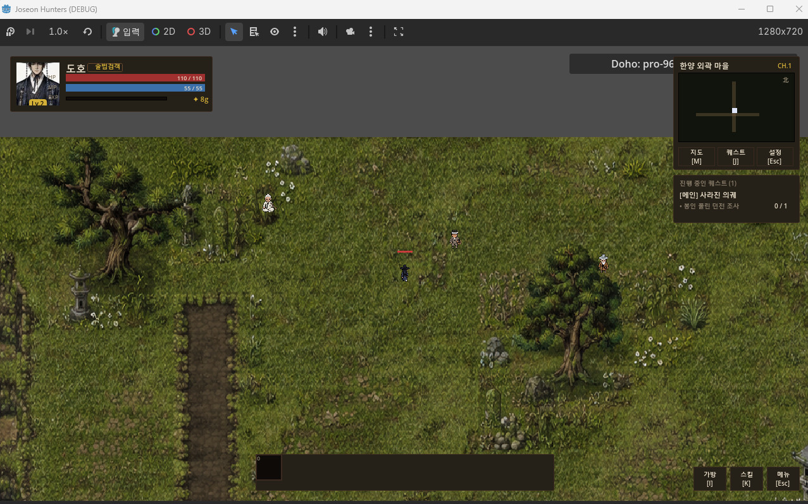

# 2026-06-03 · v1 — 2D 픽셀 탑다운 · Pixel top-down prototype

첫 버전은 2D 픽셀 아트의 탑다운 액션이었다. 첫 마을과 HUD가 처음 이어진 날의 화면이다. 넉 달 가까이 만들었지만 원하던 「디아블로 같은 손맛」이 나지 않아, 2026-09-16 세계관과 주인공만 남기고 3D 아이소메트릭으로 처음부터 다시 만들었다.

The first version was a 2D pixel-art top-down action game; this is the day the first village and HUD came together. After nearly four months it still lacked the Diablo-like feel we wanted, so on 2026-09-16 we kept only the world and the hero and started over in 3D isometric.

- 원본 · Original: [2026/06/first-village-hud.png](../../2026/06/first-village-hud.png)

다음 시점 · Next: [2026-09-17 H1 화풍 확정 · Art direction locked](../2026-09-17_h1-art-direction/)

© 2026 KOOSHA studio
