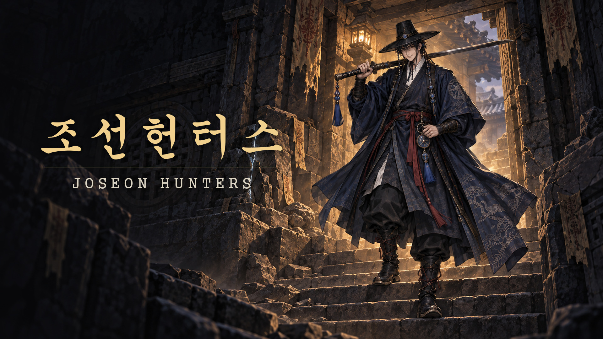
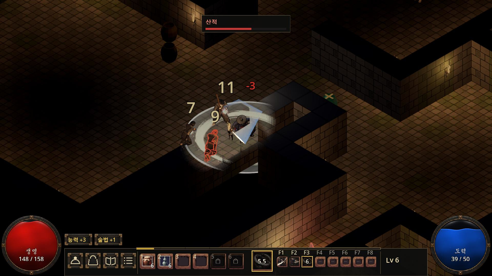
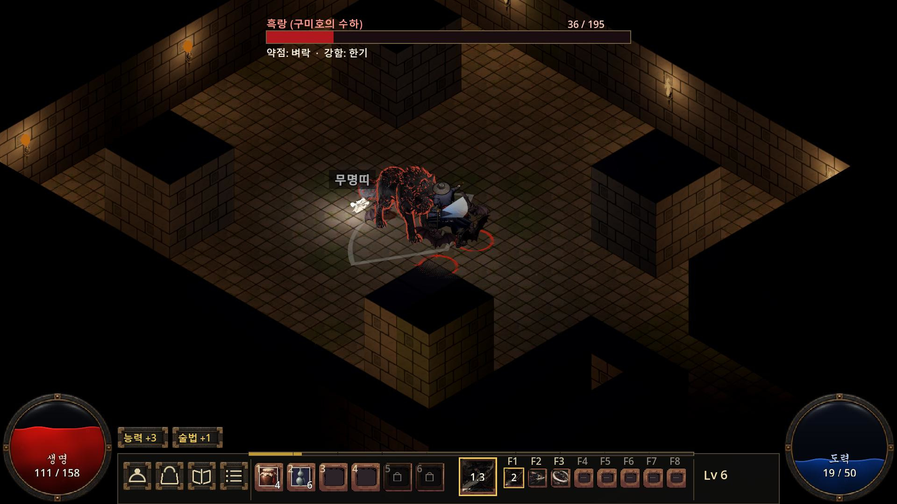
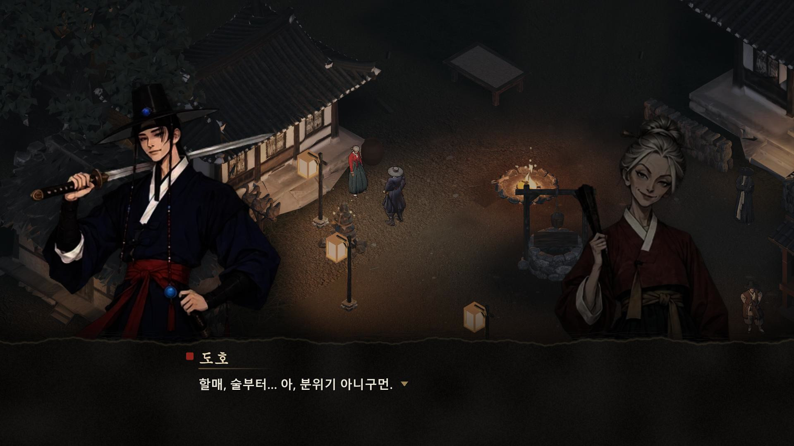
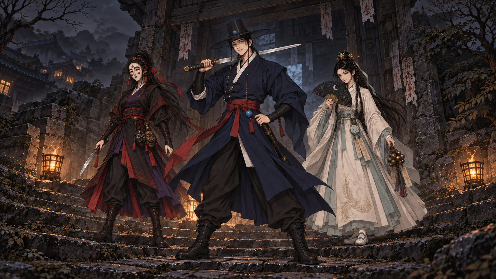

# 조선헌터스 쇼케이스 · Joseon Hunters Showcase

홍보·SNS용으로 공개하는 이미지·영상과, 게임 화면이 어떻게 바뀌어 왔는지의 기록입니다. 시점마다 날짜 폴더가 하나씩 쌓입니다(최신이 위).

Public images and videos for promotion and social media, plus a visual record of how the game has changed. Each milestone gets its own dated folder (newest first).

> 조선풍 가공 세계, 떠돌이 도사 도호가 봉인이 무너진 던전을 한 층씩 내려가 구미호를 베는 핵앤슬래시 액션 RPG.
>
> A hack-and-slash action RPG set in a fictional Joseon: Doho, a wandering Taoist swordsman, descends floor by floor into a dungeon whose seal has broken, to cut down the nine-tailed fox.

---

## 2026-09-29 · v2 버티컬 슬라이스 · Vertical slice (3D isometric)

| 회오리 베기 · Whirlwind | 흑랑 보스전 · Heukrang boss | 무당 할매 · The old shaman |
|---|---|---|
|  |  |  |

마을 → 들녘 → 굴 → 보스 → 전리품까지 처음으로 한 판이 이어진 화면. 리부트 2주 만이다.
The first build where a whole run connects — village, field, den, boss, loot — two weeks after the reboot.

- 영상 · Videos: [15초 티저 · 15s teaser](https://github.com/genesiskoo/joseon-assets/releases/download/showcase-2026-09-29/joseon-hunters_2026-09-29_teaser_15s.mp4) · [33.5초 트레일러 · 33.5s trailer](https://github.com/genesiskoo/joseon-assets/releases/download/showcase-2026-09-29/joseon-hunters_2026-09-29_trailer_33s.mp4) · [장면 클립 8개 · 8 scene clips](https://github.com/genesiskoo/joseon-assets/releases/tag/showcase-2026-09-29)
- 자세히 · Details: [2026-09-29_vertical-slice](2026-09-29_vertical-slice/)

## 2026-09-17 · H1 화풍 확정 · Art direction locked (H1)

3D로 갈아엎은 다음 날, 인물 셋을 한 화풍(H1)으로 맞췄다. 이후 원화·3D 모델·몬스터·UI가 모두 이 그림의 색과 결을 따른다.
The day after switching to 3D, we locked one shared style ("H1") for the three heroes. Every later illustration, 3D model, monster and UI element follows its colors and texture.

- 자세히 · Details: [2026-09-17_h1-art-direction](2026-09-17_h1-art-direction/)

## 2026-06-03 · v1 — 2D 픽셀 탑다운 · Pixel top-down prototype

처음에는 2D 픽셀 탑다운이었다. 넉 달 가까이 만든 뒤 2026-09-16, 세계관과 주인공만 남기고 3D 아이소메트릭으로 처음부터 다시 만들었다.
It began as a 2D pixel top-down game. After nearly four months, on 2026-09-16, we kept only the world and the hero and rebuilt everything from scratch in 3D isometric.

- 자세히 · Details: [2026-06-03_v1-pixel-topdown](2026-06-03_v1-pixel-topdown/)

---

### 쓰는 법 · How to use

- 이미지는 SNS·기사에 바로 쓸 수 있는 1920×1080 jpg다. 직접 주소 = `https://raw.githubusercontent.com/genesiskoo/joseon-assets/main/showcase/<폴더>/<파일>`
  Images are 1920×1080 jpg, ready for posts and articles. Direct link: `https://raw.githubusercontent.com/genesiskoo/joseon-assets/main/showcase/<folder>/<file>`
- 영상은 저장소를 무겁게 하지 않도록 시점마다 [Releases](https://github.com/genesiskoo/joseon-assets/releases)에 붙인다.
  Videos are attached to [Releases](https://github.com/genesiskoo/joseon-assets/releases), one per milestone, so the repository stays light.
- 제작 중 원화·후보의 변화는 `workbench/`·`archive/`·`sheets/`와 커밋 기록에 남아 있다.
  Work-in-progress art and rejected candidates live in `workbench/`, `archive/`, `sheets/` and the commit history.
- 새 시점을 더할 때 = `showcase/<YYYY-MM-DD>_<이름>/`(이미지 + README) · 영상은 `showcase-<YYYY-MM-DD>` Release · 이 문서 맨 위에 한 절.

© 2026 KOOSHA studio
