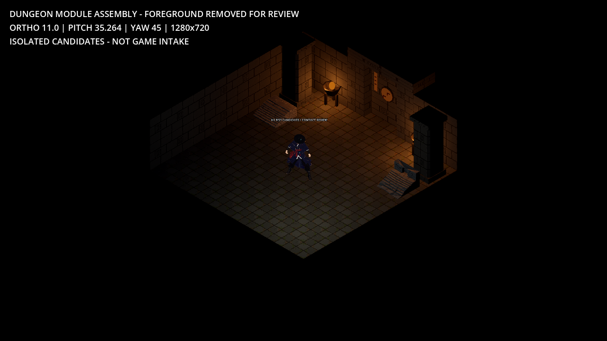
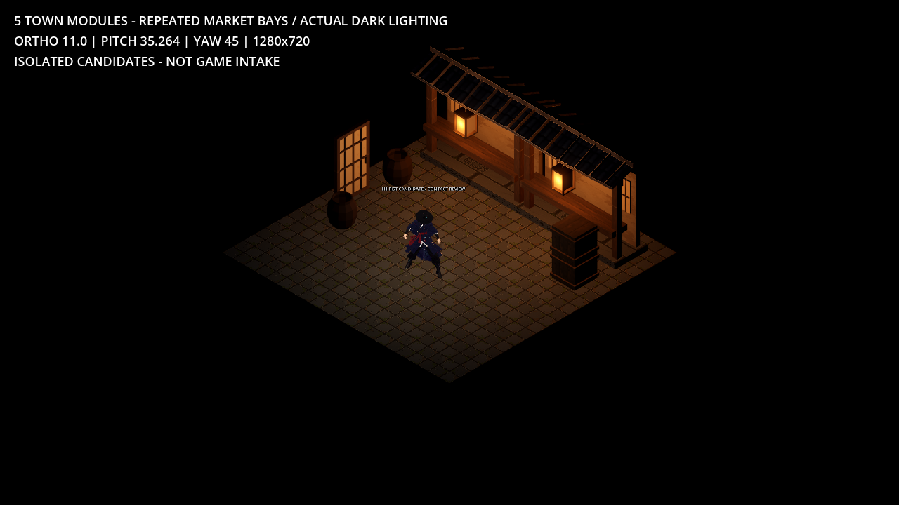

# H1 환경·소품 3D 후보 묶음

던전 9종, 마을 5종, 분리 소품 4종의 **실제 GLB 18개**와 **Godot 렌더 23장**이다. 정식 게임 반입 전 후보이며, 원화 이미지를 3D 렌더처럼 사용하지 않았다. 빠른 비교는 [실제 렌더 갤러리](index.html), 상세 수치는 [검사표](qa_report.json)와 [목록](manifest.json)을 본다.

## 형상과 재질

현재 게임 바닥·벽·계단과 텍스처를 재사용하고, 모서리·문·기둥·소품을 큰 무광 형태로 만들었다. 바닥·벽은 복사본의 인덱스 winding만 수정했고 원본 정점·UV·노멀·알베도를 보존했다. 계단은 후보 사본에서만 502→488 / 514→487 삼각형으로 줄였다. 원본 8파일의 SHA256은 시작 시점과 동일하다.

이 구조는 현재 렌더와 색·명암 관계를 유지하면서 1u 접합 규격을 직접 검증하기 위해 선택했다. AI로 타일 전체를 다시 생성하는 방법은 치수·면 방향·반복 접합 변수가 늘어나므로 이 후보 묶음에서는 사용하지 않았다. 마을은 공급받은 TEX01 1254² 아틀라스를 추가 적용했다. PNG 원본을 그대로 사용하고 목재·기와·회벽·한지 4분면을 정점 UV로 선택했다. 검집·곤봉도 목재 분면을 공유한다. 옹기와 종이부적은 단색 후보다.

원본 PNG 픽셀 후처리는 없다. 런타임 GLTFDocument가 에디터 임포트를 우회하므로 렌더 때 아틀라스의 표준 mipmap과 anisotropic 필터를 만들었다. 이 필터는 화면 축소 시 잔점·앨리어싱을 줄이며 PNG 파일은 바꾸지 않는다. 동일 최종 형상·H1·카메라·조명을 쓴 단색 control은 12/13/14번, 재질판은 01b/02/07번 캡처다.

## 파일 규격

축은 Godot Y-up, 1u=1타일이다. 바닥 상면 Y=0, 일반 환경 소품은 밑면 중앙 원점이다. 봉인문·미닫이문 앞면은 +Z다. 벽 모서리는 +X/+Z 바깥 모서리만 0.12u 모따기했다. 문틀의 열린 폭은 1.5u, 높이는 2.05u다. 총 치수는 실제 정점 AABB 기준이다.

| GLB | X × Y × Z (u) | 삼각형 | 재질 수 |
|---|---:|---:|---:|
| [바닥](models/floor.glb) | 1 × 0.1 × 1 | 12 | 1 |
| [직선벽](models/wall_straight.glb) | 1 × 2 × 1 | 20 | 1 |
| [올라가는 계단](models/stairs_up.glb) | 1 × 0.3528 × 1 | 488 | 1 |
| [내려가는 계단 후보](models/stairs_down.glb) | 1 × 0.6137 × 1 | 487 | 1 |
| [바깥 모서리](models/wall_corner.glb) | 1 × 2 × 1 | 26 | 2 |
| [문틀](models/door_frame.glb) | 3 × 2.4 × 1 | 68 | 1 |
| [봉인문](models/seal_door.glb) | 1.48 × 2.02 × 0.2935 | 268 | 4 |
| [기둥](models/pillar.glb) | 0.86 × 2.3 × 0.86 | 68 | 2 |
| [철화로](models/brazier.glb) | 0.64 × 0.69 × 0.64 | 100 | 1 |
| [목조 상점 정면](models/market_bay.glb) | 3.25 × 2.68 × 1.4508 | 452 | 6 |
| [한지 미닫이문](models/paper_sliding_door.glb) | 1 × 1.8 × 0.14 | 192 | 3 |
| [나무 상자](models/wood_crate.glb) | 0.77 × 0.7 × 0.77 | 108 | 1 |
| [옹기 항아리](models/onggi_jar.glb) | 0.68 × 0.72 × 0.68 | 288 | 1 |
| [사각 종이등](models/square_paper_lantern.glb) | 0.38 × 0.63 × 0.38 | 96 | 3 |
| [도호 검](props/doho_sword.glb) | 0.12 × 0.935 × 0.044 | 250 | 4 |
| [검집](props/doho_scabbard.glb) | 0.07 × 0.762 × 0.042 | 204 | 2 |
| [곤봉](props/bandit_club.glb) | 0.15 × 0.8 × 0.15 | 240 | 2 |
| [종이부적](props/paper_talisman.glb) | 0.08 × 0.32 × 0 | 240 | 3 |

검은 손아귀 원점, +Y 칼끝, XY 넓은 면이다. 칼날 길이 0.74u는 현재 ActorVisual 프록시와 같다. 검집 입구를 검 로컬 Y=0.06에 놓으면 내부 폭 여유 0.009u, 두께 여유 0.008u, 끝 여유 0.01u다. 곤봉도 손아귀 원점/+Y 타격부다. 종이부적은 윗변 집는 점 원점, -Y로 늘어지는 XY 평면이다. 정점 Z 두께는 정확히 0이고 세 재질 모두 double-sided다. Godot 표시 AABB의 약 0.00001u 깊이는 최소 경계 상자 패딩이다.

## 실제 렌더 검수

- 환경: 직교 크기 11, pitch 35.264°, yaw 45°, 1280×720. 프로덕션 환경·광원 값을 복사한 독립 예제 씬이다.
- 소품 확대: 직교 2.2. 손 소켓 확대: 직교 3.5. 확대 화면은 실제 인게임 표시 크기가 아니다.
- 1u 간격 바닥/벽 및 정수 좌표 모서리의 기하 접합 간격은 0u다. 문틀 아래 바닥도 포함했다.
- 같은 1.7u 마젠타 캡슐의 가시 픽셀은 앞벽 없음 2729, 불투명 앞벽 1328(48.7%), 기존 cutaway 적용 2075(76.0%)였다. 독립 메시/단일 배치 진단이다.
- 18개 GLB를 바이너리로 다시 읽어 삼각형·노멀 방향·퇴화면·해시·외부 의존성을 검사했다. 전부 500삼각형 이하, 방향 불일치 0, 퇴화면 0, 외부 텍스처/버퍼 의존성 0이다.

## H1 검 소켓

실제 H1 RightHand와 분리검의 원점/+Y축을 사용했다. 위치 `[0.0053, 0.0703, 0.026]`, 회전도 `[1.8, -174.82, 97.77]`이며, 정확한 원본 및 측정 방식은 [소켓 보고서](h1_socket_correction.json)에 기록했다. 메인 ModelDef는 수정하지 않았다.

idle/walk/attack의 12%,45%,78% 시점 9개를 렌더했다. 반지름 0.18u의 Hips→neck 프록시와 33개 칼날 표본을 비교한 최소 여유는 0.0649u다. 이 수치는 실제 스킨 표면의 충돌 검사가 아니다. 손가락 형상·그립 시각 승인은 별도이며, 최종 손아귀 상태는 보고서의 표시를 따른다. 09·10번 캡처는 기존 GT1 오프셋을 복사한 비교용이고, 11번 계열이 H1 측정값이다.

## 남은 한계

- 미승인 후보 묶음. 프로덕션 게임 반입, 충돌, 길찾기, 게임플레이, 실제 DungeonBuilder 배치 검증은 수행하지 않았다.
- 마을·곤봉·검집에 공급받은 TEX01 재질을 추가한 후보이며, 옹기·종이부적 등은 무광 단색을 유지한다. H1 원화 수준의 표면 완성본으로 승인되지 않았다.
- 기존 돌 텍스처의 규칙적인 반복 무늬를 보존했다. 기하 접합 간격 0이 시각적 텍스처 무봉제를 보증하지 않는다.
- 계단 2종은 기존 2048² 텍스처를 유지한다. 모서리·기둥은 각각 1024² 텍스처 2장 및 2재질을 사용하여 단일 1K 타일 재질 목표의 예외다.
- TEX01 공유 아틀라스는 실제 1254×1254로 1K 목표를 넘는다. 기와에 얕은 명암이 포함되어 완전 평광·seamless를 보증하지 않는다. 원본 PNG를 편집하지 않고 UV로만 4분면을 선택했다.
- stairs_down은 기존 쐐기 형상이다. 실제 바닥 개구부나 층 이동 기능이 없다.
- 문틀은 3칸 조립물, 상점은 3칸 배치 간격의 정면 한 칸이다. 상점 총폭 3.25u는 처마 돌출을 포함한다. 반복 처마 연결부는 지붕 설계 확정 시 추가 검수한다.
- 화로 불·등불 조명은 예제 씬 효과로 분리했다. GLB에는 화염, 빛, 콜리전, 문 애니메이션이 포함되지 않는다.
- 손 소켓 계산과 9개 포즈 표본은 손가락 접촉·소매 간섭·전체 공격 클립의 최종 승인이 아니다. 실제 손아귀 시각 상태는 h1_socket_correction.json을 따른다.

재현 절차와 원시 로그 위치는 [REPRODUCE.md](REPRODUCE.md)에 있다. 최종 build/render 로그는 오류 0으로 끝났으며 복구한 최초 오류도 원문으로 남겼다.
