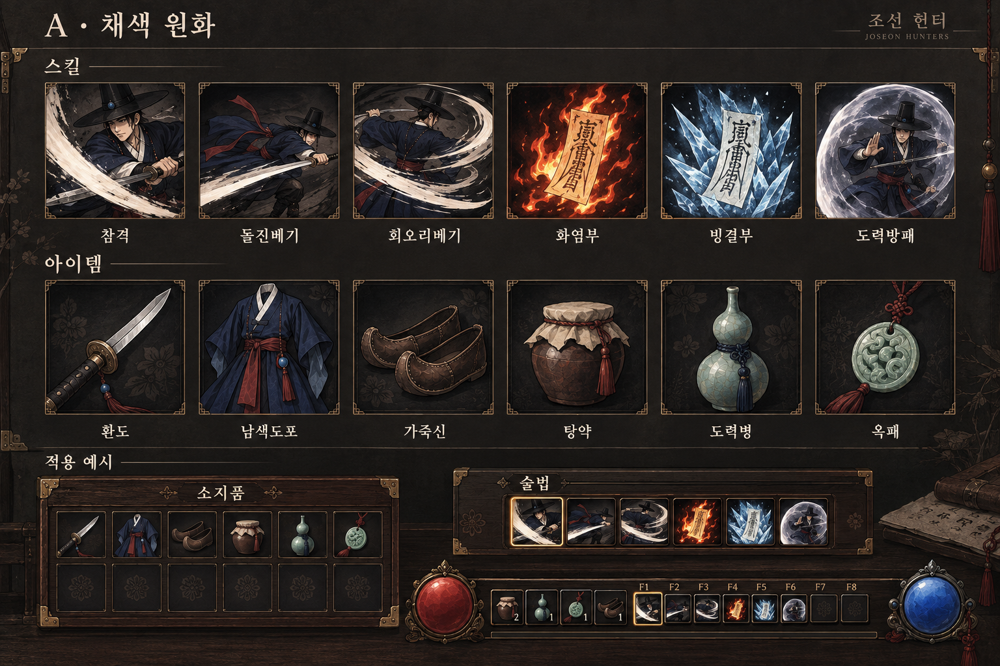
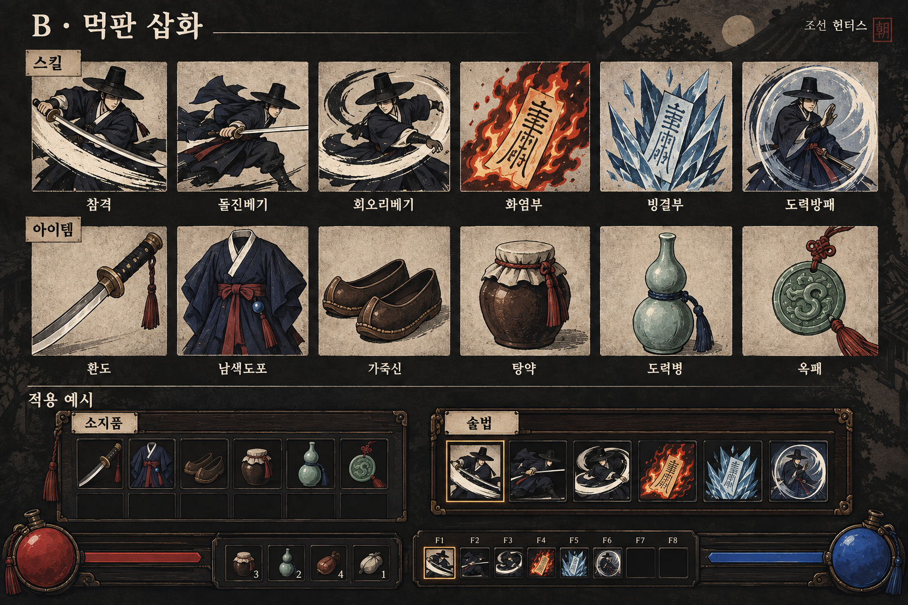

# UI·스킬/아이템 아이콘 리디자인 — #393

[GitHub 카드](https://github.com/genesiskoo/joseon-hunters/issues/393) · 브랜치 `codex/393-ui-icon-redesign` · **PD 방향 선택 대기**

같은 스킬 6종과 아이템 6종을 UI 적용 예시와 함께 비교한다. built-in image_gen으로 3안+공예 재질 보완 1장을 만들었다. 실제 인게임 적용 화면이 아닌 AI 생성 목표 시안이다.

## A · 채색 원화

## B · 먹판 삽화

## C2 · 목조 부조

## C1 · 보존한 공예 초안

- [제작 기준](BRIEF.md), [생성 후 검수](QA.md)
- 정확한 프롬프트: [A](prompt_A.txt), [B](prompt_B.txt), [C1](prompt_C.txt), [C2 수정](prompt_C2.txt)
- `generation_sources.json`: 도구가 반환한 원본 파일 경로. 복사본과 원본 SHA256 대조는 `manifest.json`.
- `references/`: H1 승인 원본과 #245 실제 캡처의 사본. H1은 왼쪽 열만 사용, 캡처는 현재 톤 참조다.

기존 게임 에셋과 #245 기능 후보는 보존했다. 스타일 선택 뒤 원본 아이콘·UI 조각의 실제 규격을 확정한다.
