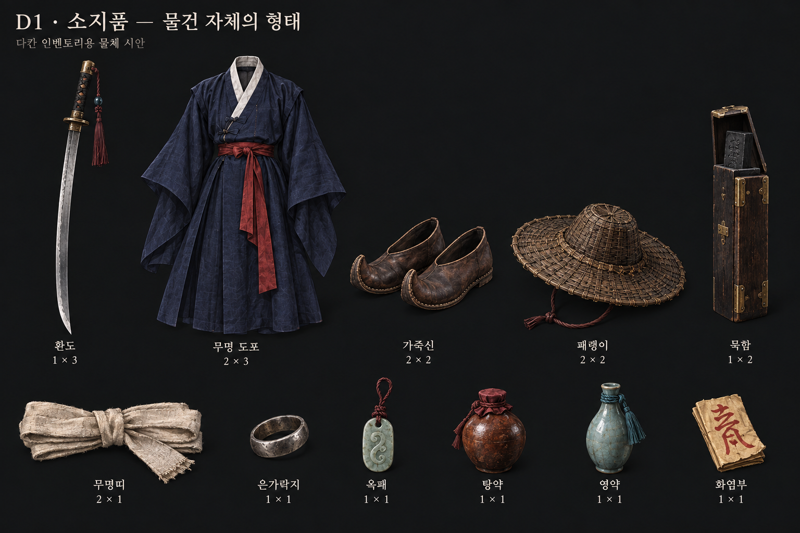
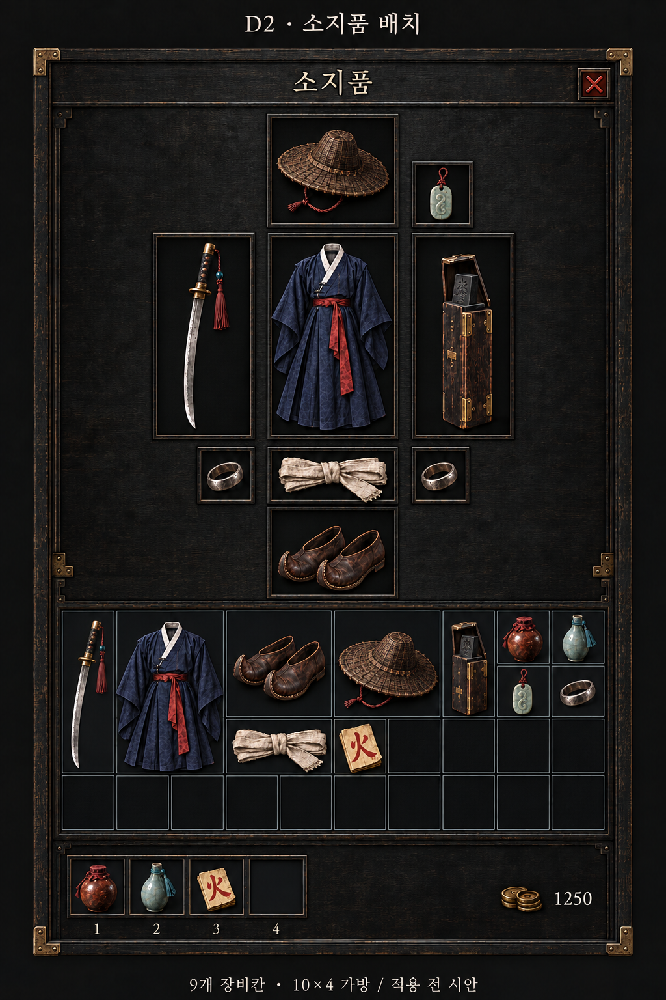
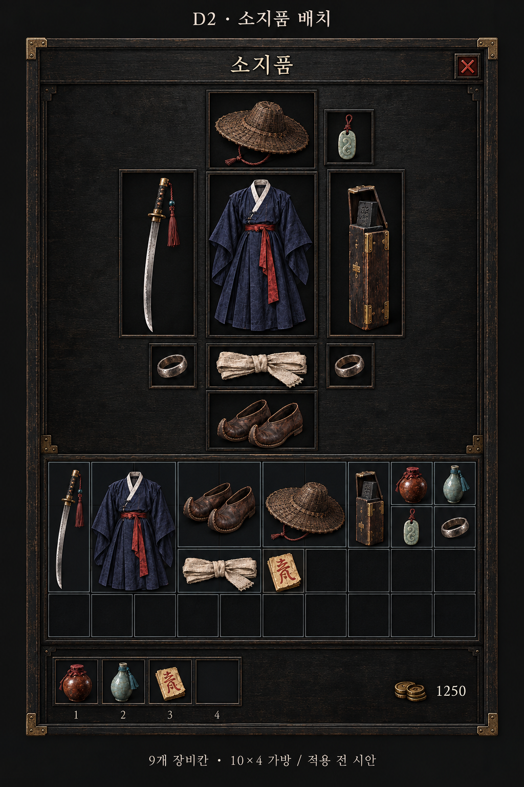

# #393 — UI·아이콘 시안

[GitHub 카드 #393](https://github.com/genesiskoo/joseon-hunters/issues/393)
상태: **D2R 소지품 교정 완료, D1 + D2b 검토 대기. 모두 미채택·미반입.**

PD 지적에 따라 스킬과 소지품의 표현을 나눴다. 스킬은 정사각 동작 일러스트 후보를 유지할 수 있지만, 소지품은 다칸 격자에 들어가는 **물체 자체의 그림**이다. 기존 A/B/C2의 정사각 액자형 소지품 방향은 철회했다.

## 최신 ① D1 — 물체 확대 시트

쇠·천·가죽·대나무·옥·도기로 구분한 11종. 물건의 전체 실루엣과 가방 칸 수를 보여 준다. 최종 투명 PNG 묶음은 아니다.

## 최신 ② D2b — 배치 보완본

9장비칸 + 10×4 가방 + 다칸 물건. 내부 격자선 흔적을 정리하고 화염부를 火 문양으로 보완했다. 실제 Godot 캡처/정밀 좌표 시안은 아니다. 장비칸 비율·서체 크기는 구현 때 정본에 맞춘다.

[교정 사양](revision_d2r/BRIEF.md) · [검수](revision_d2r/QA.md) · [아이템 표본](revision_d2r/item_samples.json) · [전체 출처·해시](manifest.json)
프롬프트: [D1](revision_d2r/prompt_D1.txt), [D2](revision_d2r/prompt_D2.txt), [D2b](revision_d2r/prompt_D2b.txt).

## 보존 — D2 첫 배치

신·패랭이 내부 세로선 흔적, 장비칸 비율, 화염부의 氣 문양을 찾아 D2b를 만들었다.

## 보존 — 이전 후보

소지품 표현은 사용자 교정으로 철회. 스킬 화풍도 아직 선택되지 않았다.

이전 프롬프트·QA는 생성 당시 기록으로 보존한다. 최신 판단은 revision_d2r/를 따른다.
